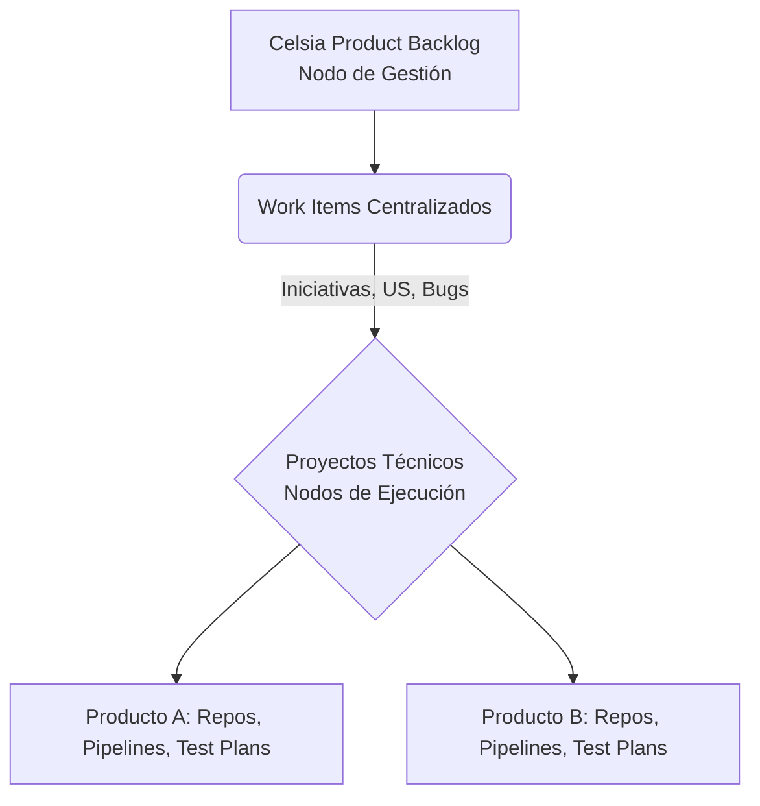
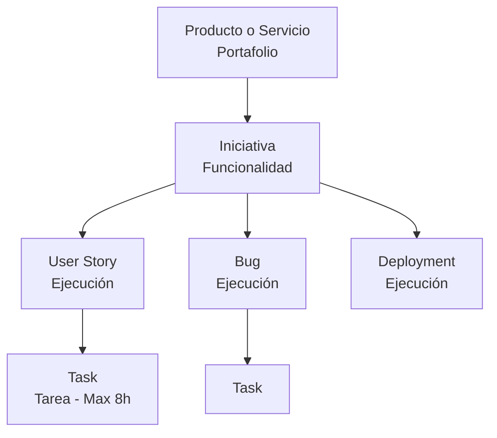
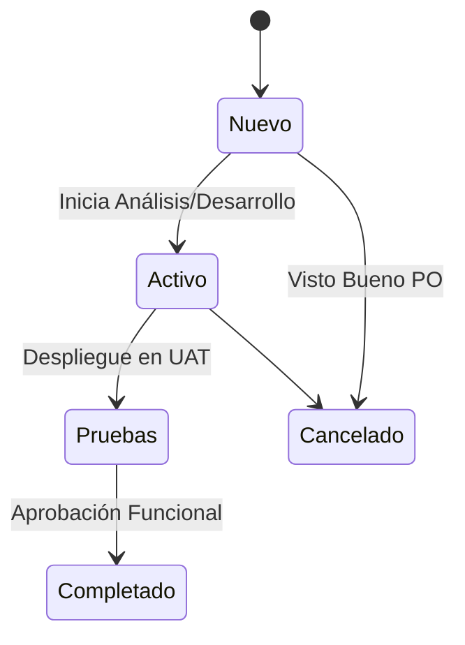
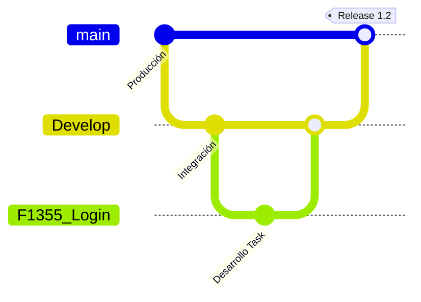

# Manual de Arquitectura y Gestión DevSecOps

## Índice de Contenidos
- [1. Introducción y Visión](#1-introducción-y-visión)
- [2. Arquitectura de Doble Nodo en Azure DevOps](#2-arquitectura-de-doble-nodo-en-azure-devops)
- [3. Jerarquía de Trabajo y Definiciones](#3-jerarquía-de-trabajo-y-definiciones)
- [4. Gestión de Capacidad y Clasificación (Paths)](#4-gestión-de-capacidad-y-clasificación-paths)
- [5. Documentación de Iniciativas](#recomendaciones-para-la-documentación-de-las-iniciativas)
- [6. El Estado (state) y Tipo de Iniciativa](#el-estado-state)
- [7. Gestión de Work Items (Task, Bug, Deployment)](#task-tarea)
- [8. Nomenclatura Git (Repos y APIs)](#sintaxis-repositorios-git)
- [9. Esquema de Versionamiento y Ramas](#esquema-de-versionamiento)
- [10. CI/CD (Pipelines y Variables)](#pipelines)
- [11. Planes de Pruebas (Test Plans)](#test-plans)

---

## 1. Introducción y Visión
El modelo de gestión de tecnología de Celsia se centra en DevSecOps, integrando seguridad, desarrollo y operaciones para crear software que pueda hacer frente a las amenazas actuales.

Modelo de Gestión de Tecnología.png

En la imagen adjunta se explica el ciclo de vida Dev,SecOps:

 Planificación: Definición de requisitos funcionales y no funcionales, incluyendo políticas de seguridad, cumplimiento normativo y amenazas potenciales.
 Codificación: Definición de requisitos funcionales y no funcionales, incluyendo políticas de seguridad, cumplimiento normativo y amenazas potenciales.
 Construcción: Automatización del proceso de build mediante pipelines CI/CD.
 Pruebas: Ejecución de pruebas automatizadas
 Lanzamiento: Validación de cumplimiento de estándares de seguridad antes del despliegue
 Despliegue: Monitoreo continuo de logs, métricas y eventos de seguridad
 Operaciones: Operación del producto
 Monitoreo: Monitoreo continuo de logs, métricas y eventos de seguridad
La estrategia evoluciona de un modelo Centrado en Iniciativas de Negocio a un modelo centrado en los Productos y Servicios.

Este cambio busca establecer estándares claros para el ciclo de vida de desarrollo (SDLC) en Azure DevOps, reduciendo reprocesos y optimizando la toma de decisiones basada en la capacidad del equipo.

Principales cambios de paradigma:

Enfocados en Productos y servicios:Los productos y servicios tienen un ciclo de vida continuo; las antiguamente llamadas "Epicas" ahora representan nuestros "Productos o Servicios" y las "Features" representan las "Iniciativas".

Centralizamos la demanda y el seguimiento en un único punto (Celsia Product Backlog) para tener visión transversal.

Separación de Responsabilidades: Desacoplamos la gestión (Work Items) de la ejecución técnica (Repos/Pipelines/Test plans) para permitir mayor flexibilidad técnica sin perder gobernanza.

## 2. Arquitectura de "Doble Nodo" en Azure DevOps

Para garantizar la gobernanza sin perder flexibilidad técnica, el modelo separa la gestión de la construcción.

### 2.1. Nodo de Gestión: Celsia Product Backlog
Propósito: Proyecto único dedicado exclusivamente a la gestión y trazabilidad.
Contenido: Centraliza el Backlog, Boards y todos los Work Items (Iniciativas, Historias, Bugs, Deployments).
Regla de Oro: En este nodo NO se almacena código fuente ni Test Plans.
### 2.2. Nodos de Ejecución: Proyectos de Producto
Propósito: Existe un proyecto técnico independiente por cada Producto o conjunto de microservicios.
Contenido: Repositorios de código (Repos), Pipelines de CI/CD, Wiki técnica del componente y la gestión de pruebas (Test Plans, Suites y Cases).
## 3. Jerarquía de Trabajo y Definiciones

La jerarquía asegura que cada unidad de trabajo esté vinculada a un activo de la compañía.

| Nivel | Tipo de Work Item | Definición y Uso |
| --- | --- | --- |
| Portafolio | Producto o Servicio | Representa el activo digital completo; su duración es indefinida mientras esté activo. |
| Funcionalidad | Iniciativa | Funcionalidad tangible que aporta valor o evolutivos de soporte y mantenimiento. |
| Ejecución | User Story | Nueva funcionalidad o cambio evolutivo que debe resolverse en un solo Sprint. |
| Ejecución | Bug | Error funcional o técnico encontrado en el producto. |
| Ejecución | Deployment | Tareas técnicas de infraestructura, configuración o pases a producción. |
| Tarea | Task | Unidad mínima de trabajo. Es obligatorio estimarla en horas. |
## 4. Gestión de Capacidad y Clasificación (Paths)
La visibilidad de la capacidad depende de la correcta asignación de rutas de área e iteración.

### 4.1. Reglas de Asignación de Rutas
Para Productos e Iniciativas (Estratégico):
Area Path: Equipo de tecnología responsable, llegando hsata el último nivel (ej. "Celsia Product Backlog\DevOps Comercial\GAMMA").
Iteration Path: Área de negocio dueña o solicitante (ej. "Celsia Product Backlog\Negocios\CO\Comercial y Regulación\Operaciones Comerciales").
Para Historias de Usuario, Bugs, Tareas y Despligues (Ejecución):
Area Path: Equipo de tecnología responsable, es importante que se seleccione hasta el ultimo nivel, es decir hasta el producto, para lograr tener una correcta segmentación de los work items (ej. "Celsia Product Backlog\DevOps Comercial\GAMMA").
¿Por qué es importante?
• Permite reportes precisos por subárea
• Facilita la asignación y seguimiento de responsabilidades
• Mejora la trazabilidad del trabajo del equipo
Iteration Path: Sprint del equipo responsable Si es para un Work Item en curso (ej. Celsia Product Backlog\Sprints\DevOps Comercial\S.26.01.2), y si aun no se ha programado debe quedar en el backlog del equipo (ej. Celsia Product Backlog\Sprints\DevOps Comercial).
### 4.2. Sprints Centralizados y Capacity
Sprint por equipo: Los Sprints pertenecen a cada equipo de Tecnología, cada equipo es reponsable de gestionar y registra su capacidad acorde a su realidad y tiempo de asignación.
Nomenclatura: S.YY.MM.Q (S=Sprint, YY=Año, MM=Mes, Q=Quincena) (ej. S.26.01.2).
Gestión de Capacidad: Se utiliza la pestaña Capacity para definir:
Días OFF
Disponibilidad de horas por dia
Tipo de actividad.
## Recomendaciones para la documentación de las iniciativas
Se consideran iniciativas todas las solicitudes, requerimientos y necesidades que provienen de los negocios o de los planes o acciones que surgen de manera interna por parte del equipo de Tecnología y que tienen como objetivo principal mejorar los procesos, productos o servicios. Esto incluye desde iniciativas para desarrollo e implantación de nuevos productos o servicios hasta pequeñas mejoras en los mismos

En el caso de productos de software, pueden ser implantaciones o implementaciones.

Las iniciativas por definición del modelo de gestión se registran a través del work ítem INICIATIVA en Azure Devops, en el proyecto Celsia Product Backlog, y esta compuesta por una serie de atributos que tienen como propósito identificar además del propósito, su origen, naturaleza, responsables, etc.

A continuación se detallan los atributos requeridos para el registro de una iniciativa y las definiciones asociadas a cada atributo, existen unos campos de base y unos campos personalizados a las necesidades del modelo.

### Campos para su diligenciamiento

| Campo | Descripción |
| --- | --- |
| Titulo de la Iniciativa: | Se usa para nombrar la iniciativa, debe ser escrito en términos de negocio. |
| Asignado a: | Responsable de la iniciativa. |
| Area Path: | Se utiliza para definir el equipo de Tecnología responsable de la iniciativa. El campo Area Path debe registrarse hasta su último nivel de detalle. |
| Iteration Path: | Define el equipo de negocio solicitante de la iniciativa (diligenciar hasta el equipo solicitante). |
| Descripción de la Iniciativa: | Detalla el objetivo, alcance y justificación de la iniciativa. |
| Beneficios: | Ahorros estimados, nuevos ingresos, energia liberada, mejoras de cara al cliente u otros. |
| Prioridad: | Es basada en la correlación del impacto que la iniciativa para el negocio y el esfuerzo técnico. |
| Fecha de Inicio: | Se usa para definir la fecha de inicio de la iniciativa. |
| Fecha Objetivo: | Se utiliza para definir la fecha estimada de entrega de la iniciativa. |
| Tipo de Iniciativa: | Se utiliza para definir el tipo de iniciativa que se esta trabajando. |
| Iniciativa Estrategica: | Para identificar las iniciativas estrategicas. |
| Miembro equipo de Tecnología: | Responsable técnico o el PM (Product Manager). |
| Product Owner: | Es la voz del cliente y del negocio dentro del equipo. |
La documentación de la iniciativa debe contemplar aspectos generales relacionados a la necesidad o problema que busca resolver la iniciativa y su solución tecnológica, especificando que componentes serán afectados directa o indirectamente con la solución planteada.

### La descripcion de la iniciativa debe contener

Objetivo*
Descripción de los objetivos que se busca alcanzar con la implementación de la iniciativa, es decir ¿Qué resultado de negocio esperamos alcanzar?.

Alcance*
Descripción de las características y funcionalidades incluidas en la solución y el detalle de lo que no está contemplado como parte de la implementación de la iniciativa.

 Que Incluye: Detalle de funcionalidades nuevas o ajustes que deben ser incorporados.
 Que Excluye: Definición clara de lo que no se entregará.
Justificación
Como justificación se exponen los argumentos con los cuales se soporta la ejecución de la iniciativa, especificando su impacto, que puede estar representado en: ahorros, nuevos ingresos, energía liberada o el impacto de cara al cliente entre otros.

 Qué: Problema detectado.
 Quién: Usuario afectado.
 Por qué: Causa raíz.
## El Estado (state)

Se utiliza para definir en que estado se encuentra la iniciativa, los estados que aplican son los siguientes:

| Estado | Proposito |
| --- | --- |
| Nuevo | La iniciativa se encuentra registrada y no ha sido iniciada. |
| Activo | La iniciativa se encuentra en proceso de analisis, diseño y desarrollo. |
| Pruebas | La iniciativa ha sido terminada y probada en términos técnicos y esta lista para las pruebas de aceptación funcional, en el caso de productos de desarrollo de software, la iniciativa se encuentra desplegada en el entorno de UAT para pruebas funcionales. |
| Completado | La iniciativa ha recibido aprobación funcional y ha sido entregada en producción para su operación. |
| Cancelado | La iniciativa ha sido desestimada y retirada del backlog de negocio. |
## Tipo de Iniciativa
Se utiliza para identificar el tipo de iniciativa asi:

| Tipo | Proposito |
| --- | --- |
| Nueva | Aplica cuando una iniciativa implica la implementaciòn o implantación de un producto nuevo |
| Mejora | Aplica cuando una iniciativa es para agregar o modificar funcionalidades a un producto ya existente |
| Cambio Regulatorio | Aplica cuando una inicativa obedece a el cumplimiento de un requisito regulatorio, no importa que el producto sea nuevo o sea una mejora o modiifcación de un producto existente |
| PRO | Aplica cuando una iniciativa tiene como objetivo cumplir un objetivo del PRO |
| ReimaginarC | Aplica cuando una iniciativa tiene como objetivo una iniciativa registrada en ReimaginarC |
| Plan Operativo | Aplica cuando la iniciativa hace parte del plan operativo del equipo de Tecnología |
### Reglas
El Iteration path no debe dejarse a nivel de la vicepresidencia, debe ser llevada hasta el equipo.
El area path debe registrar el equipo de Tecnología responsable e incluso el producto cuando aplique.
Toda iniciativa debe ser registrada en estado NUEVO.
Para que una iniciativa sea llevada a estado CANCELADO, se deberá contaron el visto bueno del PO y este debe ser adjuntado en la Iniciativa, ya sea como documento adjunto o como comentario registrado por el propio PO.
El target Date es una expectativa del negocio, los PM deben realizar una buena negociación para una correcta estimación.
Toda modificación a target Date, debe ser coordinada con el Customer de la iniciativa (PO), se deberá contar con el visto bueno del PO y este debe ser adjuntado en la épica, ya sea como documento adjunto o como comentario registrado por el propio PO en el campo Discussion.
El Product Owner es la voz del cliente y del negocio dentro del equipo de desarrollo. Su principal objetivo es maximizar el valor del producto. Este rol es el responsable de priorizar el backlog, aclarar dudas y proporcionar información necesaria para el desarrollo de funcionalidades.
El Product Manager tiene una visión estratégica y a largo plazo del producto. Se encarga de definir la estrategia del producto, analizar y gestionar el ciclo de vida completo del producto.
Toda iniciativa se registra con prioridad 4, esta solo debe cambiar una vez haya sido discutida y priorízala entre el PM y PO.
Para la priorización, se considera la correlación entre el impacto de la iniciativa y el esfuerzo técnico de la solución, para esto, el impacto es definido por el Product Owner (PO) y el esfuerzo es definido por el Product Manager (PM). La escala de medida es de 1 a 4, y cada uno de estos valores se obtiene de cruzar sobre un plano cartesiano el impacto de la iniciativa (eje y) y el esfuerzo de la iniciativa (eje x).
matriz-impacto-esfuerzo.png

Siempre que haya iniciativas pendientes de prioridad 1 o 2, no debería de abordarse una iniciativa de prioridad 3
Las iniciativas de prioridad 4 no se desarrollan, ya que no representan un valor tangible para el negocio.
Todas las iniciativas que responden a un requerimiento de carácter regulatorio tendrán prioridad 1, indiferente de su nivel de esfuerzo.

Es la descripción de un entregable o funcionalidad del software, escrita desde la perspectiva funcional, se utiliza para enfocar el desarrollo, facilitar la comunicación y la estimación del esfuerzo necesario para completar el trabajo.

A continuación se describen cada uno de los campos que se usan en Azure para el work Item de User History (Historia de Usuario)
Aquí tienes la tabla convertida a formato Markdown:

| Field | Description |
| --- | --- |
| ID | El ID es un identificador automático que la herramienta Azure Devops asigna a cada work item y que lo hace único a través de todos los proyectos registrados en la organización. |
| Titulo | Se utiliza para nombrar el Work Item respectivo: |
*User Story / Historia de Usuario: Debe ser escrita en términos de negocio y debe ser descriptivo del alcance solicitado.
| Assigned to | Usuario asignado para ejecutar el Work Item |
| --- | --- |
| State | Se utiliza para definir en qué estado se encuentra el Work Item |
| Area | Se utiliza para definir el equipo de Tecnología responsable del work item. El campo Area Path debe registrarse hasta su último nivel de detalle. |
| Iteration | Se utiliza para definir el sprint en el cual sera realizado. |
| Discussion | Se utiliza para informar avances, realizar aclaraciones o solicitar aprobaciones |
| Descripción | Se utiliza para describir las caracteristicas de negoción y las funcionalidades del entregable |
| Criterios de Aceptación | Se utiliza para definir los criterios de aceptación del cliente |
| Puntos de Historia | Métrica de estimación basada en la secuencia Fibonacci: 01 (Muy Pequeño), 02 (Pequeño), 03 (Mediano), 05 (Grande), 08 (Muy Grande), 13 (Gigante), 21 (Extraordinario). Cada valor representa el esfuerzo relativo considerando complejidad técnica, volumen de trabajo y riesgos asociados. |
Campos obligatorios para su diligenciamiento:

Title
Descripción
Criterios de Aceptación
Field (Campo): Acceptance Criteria (Criterios de Aceptación)
Los criterios de aceptación son las condiciones claras y verificables que nos dicen cuándo un entregable o funcionalidad está "lista" y cumple con lo esperado.
¿Para que nos sirven?

Claridad para Todos: Aseguran que tanto el equipo técnico como el de negocio tienen la misma visión de lo que se va a construir. ¡Adiós a las suposiciones!
Menos Sorpresas (y Bugs): Al definir claramente lo que se espera antes de empezar a codificar, reducimos drásticamente los errores y retrabajos.
Pruebas Efectivas: Son la base para crear escenarios de prueba robustos. Si sabes qué buscar, es más fácil encontrarlo (o verificar que está).
Entrega de Valor Real: Garantizan que estamos construyendo soluciones que realmente aportan el beneficio esperado por el usuario o el negocio.
Field (Campo): Calculo Story Points
Registrar los Puntos de Historia (Story Points) en cada User Story es una práctica fundamental que transforma la intuición en planificación basada en datos.

¿Por qué es tan importante hacerlo con rigor?

🔹 Medir la velocidad del equipo: Permite calcular cuántos puntos se completan por sprint, creando un indicador real y histórico de capacidad.
🔹 Planificación realista: Deja atrás las suposiciones. Con la velocidad consolidada, se estima con precisión cuánto trabajo cabe en los próximos sprints.
🔹 Protección contra la sobrecarga: Evita compromisos irreales. Un equipo que planifica con su ritmo real trabaja de forma sostenible y preserva su energía y motivación.
🔹 Motor de mejora continua: Al comparar lo planificado vs. lo entregado, el equipo identifica cuellos de botella, ajusta su refinamiento y madura como unidad.

Para el cálculo de story point en las historias de usuario, se utilizará la serie de Fibonacci en donde 1 sera complejidad baja y 21 complejidad mas alta posible.
<story_points> ::= { 1 | 2 | 3 | 5 | 8 | 13 | 21 }

## Deployment (Despliegue)

Representa una tarea específica que forma parte del proceso automatizado de entrega de software.

A continuación se describen cada uno de los field (campos) que se usan en Azure para el work Item de Deployment (Despliegue)

| Field | Description |
| --- | --- |
| ID | El ID es un identificador automático que la herramienta Azure Devops asigna a cada work item y que lo hace único a través de todos los proyectos registrados en la organización. |
| Title | Se utiliza para nombrar el Work Item respectivo: |
* Deployment: Debe ser escrito en términos técnicos descriptivos de los cambios que se desplegaran, este work item es de obligatorio cumplimiento para despliegues de ambientes productivos.
| Assigned to | Es el usuario asignado para ejecutar el Work Item |
| --- | --- |
| State | Define el estado en el que se encuentra el Work Item (Ver maquina de estados para cada work item) |
| Area | Define el equipo de Tecnología responsable del work item. El campo Area Path debe registrarse hasta su último nivel de detalle. |
| Iteration | Se utiliza para definir el sprint en el cual sera realizado. |
| Discussion | Se utiliza para informar avances, realizar aclaraciones o solicitar aprobaciones |
| Descripción | Describe el las caractteristicas o funcionalidades que se van a desplegar. |
| Arquitectura Tecnológica | Describe la arquitectura de la solución si es una solución nueva o describe los cambios en la arquitectura de la solución que se generan con el despliegue, debe incluir el link de la Wiki con el diagrama de la solución, si el nuevo despliegue no genera cambios se debe especificar "No genera cambio en la arquitectura" |
| Gestión del Cambio | Debe indicar el impacto del cambio (A quienes estamos afectando y si generamos indisponibilidad cuanto tiempo durara), de igual manera debemos especificar la logística para el despliegue. |
| Plan de Reversión | Define el plan de marcha atrás, si se presentan fallos durante el proceso de despliegue, se debe indicar el Release al que debe ser retornado el producto. |
| Entorno Implementado | Ambiente el en cual se realizara el despliegue: Development, Production, UAT |

## Task (Tarea)

Una tarea es la unidad de trabajo más pequeña y granular que forma parte de una historia de usuario.

 Las tareas proporcionan el detalle técnico de cómo se implementará la historia de usuario.

 Cada tarea se estima en términos de esfuerzo (generalmente en horas), lo que permite tener una mejor visibilidad del tiempo necesario para completar la historia de usuario.

A continuación se describen cada uno de los field (campos) que se usan en Azure para el work Item de Task (Tarea)

| Field | Description |
| --- | --- |
| ID | El ID es un identificador automático que la herramienta Azure Devops asigna a cada work item y que lo hace único a través de todos los proyectos registrados en la organización. |
| Title | Se utiliza para nombrar el Work Item respectivo, debe ser escrito en terminos técnicos. |
| Assigned to | Usuario asignado para ejecutar el Work Item |
| State | Se utiliza para definir en qué estado se encuentra el Work Item |
| Area | Se utiliza para definir el equipo de Tecnología responsable del work item. El campo Area Path debe registrarse hasta su último nivel de detalle. |
| Iteration | Se utiliza para definir el sprint en el cual sera realizado. |
| Discussion | Se utiliza para informar avances, realizar aclaraciones o solicitar aprobaciones |
| Descripción | Se utiliza para describir las caracteristicas tecnicas de la actividad o tarea. |
| Estimación Inicial | Tiempo estimado del work item, se define una sola vez al comenzar el trabajo. |
| Restantes | Tiempo restantes para completar del work item |
| Completadas | Tiempo real del work item, puede ser menor o mayor del tiempo estimado. |
| Activity | Tipo de actividad: Desarrollo, Despliegue, Diseño, Documentación, PPruebas, Requisitos |
### Reglas
Mantener 8h como regla general y permitir 16h como excepción, solo si se cumplen 3 condiciones:
1.Actividad indivisible: Dividirla generaría carga operativa innecesaria (ej. sesiones de levantamiento).

2.Justificación obligatoria: Describir en el task por qué requiere más tiempo.

3.Seguimiento en Daily: Revisar avance si la tarea se extiende más de 8 horas..

## Bug (Hallazgo)

Un Bug es un fallo o error en el código o la funcionalidad de una aplicación que causa un comportamiento inesperado o no deseado.

A continuación se describen cada uno de los field (campos) que se usan en Azure para el work Item de Bug (Errores)

| Field | Description |
| --- | --- |
| ID | El ID es un identificador automático que la herramienta Azure Devops asigna a cada work item y que lo hace único a través de todos los proyectos registrados en la organización. |
| Title | Se utiliza para nombrar el Work Item respectivo, debe ser escrito en términos técnicos. |
| Assigned to | Usuario asignado para ejecutar el Work Item |
| State | Se utiliza para definir en que estado se encuentra el Work Item |
| Area | Se utiliza para definir el equipo de Tecnología responsable del work item. El campo Area Path debe registrarse hasta su último nivel de detalle. |
| Iteration | Se utiliza para definir el sprint en el cual sera realizado. |
| Descripcion | Se utiliza para describir el bug o hallazgo y su solución. |
| Pasos para reproducir el Bug | Se usa para describir las codiciones o pasos que se deben realizar para que el bug o hallazgo se repita. |
| Discussion | Se utiliza para informar avances, realizar aclaraciones o solicitar aprobaciones |
| Justificación Solución | Razón por la que se cierra o se marca como resuelto el Bug o hallazgo. |
| Severidad | Evaluación del impacto del Bug en el producto |
| Puntos de Historia | Métrica de estimación basada en la secuencia Fibonacci: 01 (Muy Pequeño), 02 (Pequeño), 03 (Mediano), 05 (Grande), 08 (Muy Grande), 13 (Gigante), 21 (Extraordinario). Cada valor representa el esfuerzo relativo considerando complejidad técnica, volumen de trabajo y riesgos asociados. |
| Entorno Bug | Entorno en el que se encontró el Bug o hallazgo (Development, Production, UAT). |
| Incidente Number | Número del caso con el cual fue reportado el Bug o hallazgo. |
Campo Found In Stage

El campo obligatorio "Stage" se usa para clasificar la etapa donde se identifica el bug/hallazgo.

Wiki_Bug_Found in Stage.jpg

Las opciones se deben marcar según las siguientes definiciones:

Development: Hallazgo detectado durante la fase de desarrollo.

UAT: Hallazgo detectado durante el proceso de pruebas de aceptación (ambiente calidad).

Production: Hallazgo detectado en ambiente de Producción, posterior al proceso de liberación y finalizado el proceso de pruebas del desarrollo.

Wiki_Bug.jpg

**Consultas del Bug por el módulo "Queries".

A continuación, imagen de una consulta para el campo:
CampoNuevoClasificaciónBugs_v2.png

Descripción general de la solución que se entregara con las principales características e información relevante de ala solución, información que quedara documentada sobre el producto con:

Arquitectura general de la solución*
Diagrama de alto nivel de La solución, la cual debe estar enmarcada dentro de los lineamientos de la arquitectura tecnológica de Celsia. Ver Y22-M03 Marco de referencia TIC v4.0.pdf
NOTA: <<Incluir diagrama de arquitectura de alto nivel>>

Ejemplo: diagrama de alto nivel

cloud infraestructure.png

Diagrama de procesos
En el diagrama de procesos se muestra el orden de ejecución de las actividades y las relaciones con otros procesos, lo cual ayuda a proporcionar una visión del alcance del proceso que se impactará con la implementación de la solución, preferiblemente haciendo uso de la notación BPMN , que permita tener una descripción visual e intuitiva para facilitar el entendimiento por parte de todos los interesados.
NOTA: <<Incluir diagrama de procesos>>

Ejemplo: diagrama de procesos

diagrama de procesos.png

Flujos de Información*
En el diagrama de flujo se deben ilustrar el proceso y la secuencia en que se realizan las actividades asociadas a la iniciativa.
Ejemplo diagrama de flujo

Supuestos
Establezca las situaciones o eventos que se consideran o asumen como ciertas al momento de su identificación y que son relevantes para llevar a cabo el proyecto.

Ámbito Legal y/o Regulatorio
Relacione las normas legales y regulatorias relacionadas a la iniciativa y en las cuales está fundamentada la necesidad>>

Restricciones
Se establecen ciertas situaciones o eventos identificados que son impedimentos para el desarrollo de la iniciativa.

Riesgos
Se registran los riesgos identificados detallando el tipo de riesgo, el impacto que causa su materialización y la probabilidad de ocurrencia del evento.
Plantilla Matriz de Riesgos (1).xlsx

Necesidades Funcionales*
Features

RF_001 << Nombre del requerimiento 001 >>
<<Incluir la especificación funcional del requerimiento No. 001 >>

RF_002 << Nombre del requerimiento 002 >>
<<Incluir la especificación funcional del requerimiento No. 002 >>
...

RF_NNN << Nombre del requerimiento NNN >>
<<Incluir la especificación funcional del requerimiento No. NNN >>

NOTA: En caso de disponer de un documento de levantamiento de la necesidad donde se detallen los requerimientos, hacer referencia a dicho documento.
[Ver +...](<<attachments>>)

Otras necesidades*
Se debe especificar los requerimientos no funcionales asociados a la solución con relación a:

Usuarios y perfiles
Control de Acceso
Seguridad
Auditoria
Disponibilidad
Rendimiento
Interoperabilidad
Experiencia de usuario
Mediaciones*
En caso de ser necesario, se deben relacionar las integraciones del producto o solución con otros sistemas que fueron identificadas y que son requeridas para el cumplimiento del alcance de la iniciativa.

| Nombre | Origen | Destino | Tecnología | Descripción |
| --- | --- | --- | --- | --- |
| <<Identificador de la Integración>> | <<Sistema que envía los datos o consume el servicio>> | <<Sistema que recibe los datos o expone el servicio>> | <<Tecnología Utilizada>> | <<Detalle de funcionalidad de la integración>> |
NOTA: <<Adjunte los diagramas de secuencia a nivel funcional de las mediaciones identificadas>>

Modelo de Datos*
Si dispone de la información, Incluir el modelo de datos con las entidades y las relaciones entre los elementos impactados con la implementación de la iniciativa.

NOTA: <<Adjunte un diagrama de clases o el Modelo entidad relación>>

Prototipo
Si como parte del diseño se elaboran prototipos, tales como Mockups, Wireframes, maquetas o Sketching se deben anexar las imágenes, videos o documentos que muestren el prototipo realizado o hacer referencia a la ubicación donde se encuentre alojado el prototipo de acuerdo a la herramienta seleccionada.

NOTA: <<Relacione el prototipo de la solución esperada con la implementación de la la iniciativa>>

Criterios de aceptación*
NOTA: <<Relacione los ítems que se validarán al momento de la entrega con los cuales será aceptada la solución. A continuación se listan algunos ejemplos de los criterios generales a tener en cuenta.>>

Cumplimiento a los lineamientos internos de:

Arquitectura (Marco de referencia TIC)

Ciberseguridad

Marca e imagen corporativa

Validación de entrega de:

Ambientes de la solución operativos y funcionando

Módulos de administración y parametrización implementados y funcionando

Definición e implementación del esquema de soporte de la solución

Actas de aceptación de pruebas funcionales y de integración aprobadas

Documentación del proyecto:

Documentación técnica actualizada (diseño de la solución, diagrama de componentes, manual de explotación, etc.)

Manuales funcionales de la solución y/o video de su funcionamiento

Entrega documentación del proyecto (seguimientos, actas, documentación de pruebas, controles de cambios, etc.)

Capacitación de la solución:

Plan de formación

Capacitación funcional

Capacitación técnica para soporte y mantenimiento de la solución

Documentos Anexos*
Documento 1
[Descripción documento 1](<<attachments>>)

Documento 2
[Descripción documento 2](<<attachments>>)

## Sintaxis Repositorios (Git)

A continuación, se describe la sintaxis para el nombre de los repositorios (Git), esta regla aplica para todo componente de software excepto las API´s.

-- Sintaxis nomenclatura
CELSIA.<project_name>.<resource_name>

-- Project name: nombre del proyecto
<product_name> ::= [a-zA-Z0-9]

-- Resource name: sigla del recurso a desplegar
<resource_name> ::= [a-zA-Z0-9]

  
- [ ] **CELSIA**: Este es un prefijo de la organización o empresa. Sirve para identificar que el recurso pertenece a esta compañía. Al usarlo, se evita cualquier posible conflicto de nombres y se facilita la búsqueda de activos dentro del entorno de la organización.

- [ ] **<project_name>**: Este es el nombre del proyecto al que pertenece el recurso. El formato [a-zA-Z0-9] indica que el nombre solo puede contener letras (mayúsculas o minúsculas) y números. Usar un nombre de proyecto claro y conciso ayuda a agrupar todos los recursos relacionados con una iniciativa específica.

- [ ] **<resource_name>**: Esta es una sigla que identifica el tipo de recurso que se va a desplegar. La lista (sqldb, BackEnd, FrontEnd, DataFactory, etc.) son las siglas que se deben utilizar. Esto clasifica los recursos por su función, lo que hace que sea muy fácil saber qué contiene el repositorio o el recurso solo con ver su nombre.

Listado de siglas de los componentes mas comunes:
- sqldb - Bases de datos, scripts DML y DDL
- BackEnd - Código fuente del backend
- FrontEnd - Código fuente del front
- DataFactory - Servico Azure de DataFactory
- IaaC - Archivos de despliegue de la infraestructura como código, entre otros ARM templates, scripts de powershell
- Service - Código fuente de servicios windows
- BlobStorage - Servicio de Azure BlobStorage
Ejemplos Sintaxis Repositorios (Git)

A continuación algunos ejemplos de aplicación de la sintaxis:

Supongamos que tenemos un producto que se se encarga del procesamiento e correo electrónico, su nombre es Mail Processing y en su construcción se utilizaron varios componentes, entre ellos un servicio windows, base de datos, servicios cognitivos de Azure, data factory, tableros de power BI, etc., los repositorios para cada uno de esos componentes serían los siguientes:

CELSIA.MailProcessing.Azure.CognitiveServices
CELSIA.MailProcessing.Azure.DataFactory
CELSIA.MailProcessing.Azure.SQLDB
CELSIA.MailProcessing.IaaC
CELSIA.MailProcessing.Service
Otro ejemplo, Producto Direct TV GO, el cual tiene componentes diferentes:

CELSIA.DirectTVGO.FrontEnd
CELSIA.DirectTVGO.Middleware
CELSIA.DirecTVGO.IaaC
CELSIA.DirecTVGO.Identity
CELSIA.DirecTVGO.WebApp

## Sintaxis nomenclatura API´s

A continuación, se describe la sintaxis para el nombre de los repositorios (Git): API´s.

-- Sintaxis nomenclatura
api.<project_name>.celsia

-- Project name: nombre del proyecto
<product_name> ::= [a-zA-Z0-9]

Listado de siglas de los componentes mas comunes:

API - Application Program Interface

 api: Este prefijo identifica de inmediato que el recurso es una API. Esto es crucial para la gestión de APIs, ya que permite a los desarrolladores y a los equipos de operaciones diferenciar los servicios de aplicaciones web, bases de datos u otros componentes.

 <project_name>: Este es el nombre del proyecto o servicio al que pertenece la API. Utilizando solo letras y números ([a-zA-Z0-9]), el nombre debe ser conciso y descriptivo para que el propósito de la API sea claro. Por ejemplo, PagosPse indica que la API gestiona pagos PSE, y authentication se refiere a un servicio de autenticación.

 CELSIA: Según el namespace del proyecto

Ejemplos de nombramiento de API´s:

api.PagosPse.celsia
api.autehntication.celsia

## Esquema de Versionamiento
Scope: Repos (Files, Tags), Pipelines

A continuación, se describe el esquema de versionamiento a utilizar.

-- Sintaxis versionamiento
Version-<version_mayor>.<version_menor>.<revision>.<estabilidad>

-- Versión mayor: nos indica la versión principal y se utiliza cuando agregamos funcionalidades (Functions on Boards).
<version_mayor> ::= [n]

-- Versión menor: se utiliza cuando completamos historias de usuario (Stories on Boards).
<version_menor> ::= [n]

-- Revisión: se utiliza cuando se realizan correcciones menores (fix a errores identificados).
<revision> ::= [n]

-- Estabilidad: se utiliza cuando se realizan correcciones menores. Los valores a establecer son: 0 (Version liberada), 1 (candidato a release con VoBo en UAT por parte del funcional -RC-), 2 (versión estable -Beta-), 3 (versión inestable -Alpha-)
<estabilidad> ::= { 0 | 1 | 2 | 3 }

**Observaciones**
  
- [ ] Version-<version_mayor>: Este es el primer número, la versión principal. Aumenta cuando se implementan nuevas funcionalidades significativas. Ejemplo: Pasar de Version-1.0.0.0 a Version-2.0.0.0 si se agrega un módulo de pago completamente nuevo.

- [ ] <version_menor>: El segundo número, la versión menor, incrementa cuando se completan historias de usuario o se han añadido nuevas características, pero no tan grandes como para justificar un cambio de versión mayor. Ejemplo: Pasar de Version-1.1.0.0 a Version-1.2.0.0 si se implementa una nueva forma de filtrar resultados de búsqueda.

- [ ] <revision>: El tercer número se usa para las revisiones o correcciones de errores menores ("bug fixes"). Aumenta cada vez que se soluciona un problema sin agregar nuevas funcionalidades. Esto es útil para rastrear correcciones de bugs en el código. Ejemplo: Pasar de Version-1.2.1.0 a Version-1.2.2.0 después de corregir un error visual.

- [ ] <estabilidad>: Este es el componente indica el estado de madurez del código y se utiliza cuando se realizan correcciones menores.

Branches (Rama)

Un branch o rama es una versión paralela del código de un proyecto que permite a los desarrolladores trabajar en nuevas características o correcciones de errores sin afectar la versión principal y estable del código conocida como «[rama principal]o «rama de producción». Las ramas son fundamentales en el control de versiones permitiendo el desarrollo colaborativo en paralelo, la experimentación segura y la integración controlada de cambios a través de un proceso de fusión (merge).

 Main: Es la rama principal y sagrada. Representa el código en un estado de producción o listo para ser desplegado. Solo se fusionan a ella las ramas de release que han pasado por todas las pruebas y validaciones. La rama Main debe ser siempre estable.

 Develop: Es la rama de integración principal para el equipo. Todos los features y correcciones de errores se fusionan aquí después de ser desarrollados en ramas temporales. La rama Develop es el reflejo del estado más reciente del trabajo que está en curso. A partir de ella se crean las ramas de release.

Wiki_Branch.png

 Ramas de features (F1355 Login, F1356 Logout, F1357 Change password): Son las ramas donde trabaja el desarrollador.
 Un desarrollador crea una de estas ramas a partir de la rama Develop local para trabajar en una funcionalidad o tarea específica.

 Pipelines
Azure Pipelines es la parte de Azure DevOps que combina [la integración continua, las pruebas y la entrega continuas para compilar, probar e implementar proyectos de código automáticamente en cualquier destino.

### Build
A continuación, se describe la sintaxis para el nombre de los build pipeline.

-- Sintaxis nomenclatura
<product_name>-<resource_name>[-<version>]-CI

-- Project name: nombre del proyecto
<project_name> ::= [a-zA-Z0-9_\.]

-- Versión: versión mayor del release a desarrollar
<version> ::= v[0-9]

-- Resource name: sigla del recurso a desplegar
<resource_name> ::= [a-zA-Z0-9]
### Releases (CD)
A continuación, se describe la sintaxis para el nombre de los release pipeline.

-- Sintaxis nomenclatura
<product_name>.<resource_name>.<stage_number>.<version>-CD

-- Project name: nombre del proyecto
<project_name> ::= [a-zA-Z0-9_\.]

-- Resource name: sigla del recurso a desplegar
<resource_name> ::= [a-zA-Z0-9]

-- Stage number: indica los entornos en los cuales se ha desplegado la solución
<stage_number> ::= <develop><uat><prd>
<develop> ::= { 0 | 1 }
<uat> ::= { 0 | 1 }
<prd> ::= { 0 | 1 }

-- Versión: versión mayor del release a desarrollar
<version> ::= v[0-9]

## Modulo Library en Pipelines
La funcionalidad de Library (librerías o bibliotecas de variables) en Azure Devops es:

Almacenar variables de datos técnicos relevantes relacionados con el producto en el cual están definidas.

Disponer de variables que permiten parametrizar por entorno los pipelines de despliegue continuo de los productos.

La funcionalidad de Library es parte del Módulo Release en Azure Devops:

guia library - pic1.png

A continuación encontrarán los estándares de creación y nombramiento de bibliotecas de variables y variables y algunos bancos de variables ya definidas para acelerar la adopción de su uso:

Estándares

Banco de variables

Sintaxis de Nombramiento
Scope: Biblioteca de variables

A continuación, se describe el esquema de nombramiento a utilizar.

-- Release: nos indica el release para el cual están definidas estas variables.
<Release-#.#.#.#>

-- Grupo de variables: se utiliza para el registro de las variables de cualquier producto (Global Variables, API´s, etc).

  <Global Variables> = Se usa para las variables base de todo producto / servicio, hablamos de servidores, bases de datos, data factory, storage account, variables de configuración)

  API-<Nombre de la API> = Se usa para las variables asociadas a la publicación de las APIS

-- Entorno: Nos indica el entorno al que hacen referencia las variables
(<develop>.<uat>.<prd>)
Ejemplos
A continuación algunos ejemplos de aplicación:

Supongamos que tenemos un producto que esta en su release 3.1 y que ya se encuentra en producción, por ende cuenta con sus 3 entornos, las bibliotecas de variables que debe tener el producto en DevOps son:

Release-3.1.0.0 Global Variables (develop)
Release-3.1.0.0 Global Variables (uat)
Release-3.1.0.0 Global Variables (prd)
Adicionalmente este producto tiene una API en la cual es posible gestionar órdenes de trabajo, la librería de variables debería llamarse:

Release-3.1.0.0 API-Gestión de Ordenes (develop)
Release-3.1.0.0 API-Gestión de Ordenes (uat)
Release-3.1.0.0 API-Gestión de Ordenes (prd)
ATENCIÓN

Todo producto o servicio debe contar como mínimo con la biblioteca de variables globales, las demás bibliotecas se deben crear en la medida en que estén presentes los elementos descritos.

Ejemplos de nombres de variables
Estos son algunos de los ejemplos de nombres de variables que pueden usar como referencia:

| Nombre | Descripción |
| --- | --- |
| ResouceGroupLocation | Ubicación del grupo de recursos |
| ResourceGroupName | Nombre del grupo de recursos |
| -- | -- |
| BlobPublicAccess |  |
| -- | -- |
| DataFactoryName | Nombre de data factory |
| DataFactoryLinkedServices_1_Name | Nombre del servicio vinculado |
| DataFactoryLinkedServices_1_Key | Llave de acceso del servicio vinculado |
| -- | -- |
| NsgName | nombre del network security group en Azure |
| NsgRuleName_1 | nombre de la regla en el nsg |
| NsgRuleSourceAddressPrefix_1 |  |
| NsgRuleSourcePortRange_1 | rango de puertos de origen de la regla |
| NsgRuleDestinationPortRange_1 | rango de puertos de destino de la regla |
| -- | -- |
| ReleaseNumber |  |
| -- | -- |
| SqlAdminLogin | usuario admin de la base de datos |
| SqlAdminPassword | password del usuario admin de la base de datos |
| SqlBlobContainerName |  |
| SqlCollationName |  |
| SqlDatabaseName | nombre de la base de datos |
| SqlDataFactoryUserName |  |
| SqlDataFactoryUserPassword |  |
| SqlFirewallRuleEndIpAddress |  |
| SqlFirewallRuleName |  |
| SqlFirewallRuleStartIpAddress |  |
| SqlLocation |  |
| SqlPerformanceLevel |  |
| SqlPowerBIUserName | Usuario de conección para publicación de tableros de power bi |
| SqlPowerBIUserPassword | Password del usuario para publicación de tableros de power bi |
| SqlResourceGroupName |  |
| SqlServerEdition |  |
| SqlServerName | nombre del servidor de base de datos |
| SqlServerNameFQDN | nombre publico de acceso a la base de datos |
| SqlServerVersion | versión del motor de base de datos |
| SqlStorageAccountAccessTier |  |
| SqlStorageAccountkind |  |
| SqlStorageAccountName |  |
| SqlStorageAccountSku |  |
| SqlWinServiceUserEncryptionPrivateKey |  |
| Sql<producto>UserName | Usuario dueño del esquema/base de datos del produto |
| Sql<producto>UserPassword | Password dueño del esquema/base de datos del produto, debe estas encriptado |
| Sql<producto>UserPasswordRSA | Llave privada con la que se encripto el password del usuario dueño del esquema/base de datos del produto |
| -- | -- |
| StorageAccountAccessTier |  |
| StorageAccountKind |  |
| StorageAccountName |  |
| StorageAccountSku |  |
| -- | -- |
| TagServiceName |  |
| TagTeamLevel1 |  |
| TagTeamLevel2 |  |
| -- | -- |
| VMLocalAdminPassword | Password del suario administrador local del servidor |
| VMLocalAdminUser | Usuario administrador del servidor |
| VMName | Nombre del servidor |
| VMNameFQDNWinRMPort | Nombre publico del servidorpara acceso por control remoto |
| VMOffer |  |
| VMPublisherName |  |
| VMSize | tamaño del servidor |
| VMSkus | sku´s del servidor |
| VMStorageAccountAccessTier |  |
| VMStorageAccountkind |  |
| VMStorageAccountName |  |
| VMStorageAccountSku |  |
| -- | -- |
| VnetAddressPrefix |  |
| VnetName | nombre de la red virtual |
| NicName | Nombre recurso de tarjeta de red |
| PublicIpAddressName | nombre publico de la ip (DNS) |
| SubnetAddressPrefix |  |
| SubnetName | Nombre de la subred |

## Esquema de Versionamiento
Scope: Repos (Files, Tags), Pipelines

A continuación, se describe el esquema de versionamiento a utilizar.

-- Sintaxis versionamiento
Version-<version_mayor>.<version_menor>.<revision>.<estabilidad>

-- Versión mayor: nos indica la versión principal y se utiliza cuando agregamos funcionalidades (Functions on Boards).
<version_mayor> ::= [n]

-- Versión menor: se utiliza cuando completamos historias de usuario (Stories on Boards).
<version_menor> ::= [n]

-- Revisión: se utiliza cuando se realizan correcciones menores (fix a errores identificados).
<revision> ::= [n]

-- Estabilidad: se utiliza cuando se realizan correcciones menores. Los valores a establecer son: 0 (Version liberada), 1 (candidato a release con VoBo en UAT por parte del funcional -RC-), 2 (versión estable -Beta-), 3 (versión inestable -Alpha-)
<estabilidad> ::= { 0 | 1 | 2 | 3 }

**Observaciones**
  
- [ ] Version-<version_mayor>: Este es el primer número, la versión principal. Aumenta cuando se implementan nuevas funcionalidades significativas. Ejemplo: Pasar de Version-1.0.0.0 a Version-2.0.0.0 si se agrega un módulo de pago completamente nuevo.

- [ ] <version_menor>: El segundo número, la versión menor, incrementa cuando se completan historias de usuario o se han añadido nuevas características, pero no tan grandes como para justificar un cambio de versión mayor. Ejemplo: Pasar de Version-1.1.0.0 a Version-1.2.0.0 si se implementa una nueva forma de filtrar resultados de búsqueda.

- [ ] <revision>: El tercer número se usa para las revisiones o correcciones de errores menores ("bug fixes"). Aumenta cada vez que se soluciona un problema sin agregar nuevas funcionalidades. Esto es útil para rastrear correcciones de bugs en el código. Ejemplo: Pasar de Version-1.2.1.0 a Version-1.2.2.0 después de corregir un error visual.

- [ ] <estabilidad>: Este es el componente indica el estado de madurez del código y se utiliza cuando se realizan correcciones menores.

## Test Plans

Las pruebas exploratorias (Ambiente DEV) y las pruebas de aceptación son dos tipos de pruebas de software con enfoques y objetivos diferentes. Las pruebas exploratorias se centran en la exploración del software por parte del tester, utilizando su experiencia para encontrar defectos de forma dinámica, mientras que las pruebas de aceptación (Ambiente UAT) son pruebas funcionales para verificar que el software cumple con los requisitos antes de su lanzamiento.

Test plan (Plan de pruebas)

Los planes de prueba se organizarán por entorno, con casos de prueba específicos para cada tipo de prueba.
Por ejemplo, las pruebas exploratorias o técnicas (unitarias, de componentes, integración) se realizarán en el plan de pruebas exploratorias/experimentales en el entorno de desarrollo.
Las pruebas de aceptación o UAT (sistema, end to end, pruebas funcionales de aceptación, rendimiento) se llevarán a cabo en el plan de pruebas de aceptación.

Pruebas Exploratorias (Técnicas): { Unitary Testing | Integration Testing | Exploratory testing | Security testing }
Pruebas de Aceptación (UAT): {User acceptance testing | Performance testing | Automation testing | Regression testing }

Campos del Work Item:

A continuación se describen cada uno de los field (campos) que se usan en Azure para el work Item:

| Field | Descripción |
| --- | --- |
| ID | El ID es un identificador automático que Azure DevOps asigna a cada work item y que lo hace único a través de todos los proyectos de la organización. |
| Title | Se utiliza para nombrar el Work Item respectivo, debe ser escrito en términos técnicos. |
| Assigned to | Usuario asignado para ejecutar el Work Item. |
| State | Se utiliza para definir en qué estado se encuentra el Work Item. |
| Area | Se utiliza para definir el equipo de negocio solicitante de la iniciativa; debe diligenciarse hasta el equipo al que pertenece el solicitante. |
| Iteration | Se utiliza para definir el equipo de Tecnología responsable de la iniciativa. |
| Discussion | Se utiliza para informar avances, realizar aclaraciones o solicitar aprobaciones. |
| Description | Se utiliza para describir el objetivo y alcance del Work Item. |
| Finish date | fecha fin |
| Steps | Pasos de los prueba |
Sintaxis para el nombramiento de los Test plan (Plan de pruebas)

A continuación, se describe la sintaxis para el estándar de nombramiento de los planes de prueba

Sintaxis para nombramiento de planes de pruebas

-- Sintaxis nomenclatura

<Tipo de Prueba> - <Descripcion del entregable> - <ID US / BUG>

-- Tipo de Prueba: Tipo de prueba que se esta realizando por ejm.Prueba Exploratoria: Si es técnica - Prueba de Aceptación: Si es funcional

-- Descripción del entregable: Breve descrición del entregable o funcionalidad que se esta probando

--ID US / BUG: ID del work item que ha generado la prueba, el cual determina responsable y sprint de ejecución.

Ejemplos:

Escenario 1 Pruebas Exploratorias:

-- Prueba Exploratoria - Mejora de compensaciones – US103453
-- Prueba Exploratoria - LAC Diario No identifica evento de cierre – BUG101216

Escenario 2 Pruebas de Aceptación:

-- Prueba Aceptación - Mejora de compensaciones – US104034
-- Prueba Aceptación - LAC Diario No identifica evento de cierre – BUG101216

### Reglas

Pruebas Explortorias: Estas pruebas son técnicas, se realizan en el servidor de desarrollo antes de pruebas con el cliente. Enfoque de testing donde el PM diseña y ejecuta pruebas basándose en su experiencia, intuición y conocimiento del sistema para descubrir defectos no previstos.

Test Case (Casos de Prueba)

Es una especificación técnica que describe un conjunto de condiciones, entradas, acciones y resultados esperados diseñados para verificar el correcto funcionamiento de una funcionalidad o requisito de un sistema.

Campos del Work Item

A continuación se describen cada uno de los field (campos) que se usan en Azure para el work Item:

| Field | Descripción |
| --- | --- |
| ID | El ID es un identificador automático que Azure DevOps asigna a cada work item y que lo hace único a través de todos los proyectos registrados en la organización. |
| Title | Se utiliza para nombrar el Work Item respectivo, debe ser escrito en términos técnicos. |
| Assigned to | Usuario asignado para ejecutar el Work Item. |
| State | Se utiliza para definir en qué estado se encuentra el Work Item. |
| Area | Se utiliza para definir el equipo de negocio solicitante de la iniciativa; debe diligenciarse hasta el equipo de negocio al que pertenece el solicitante. |
| Iteration | Se utiliza para definir el equipo de Tecnología responsable de la iniciativa. |
| Discussion | Se utiliza para informar avances, realizar aclaraciones o solicitar aprobaciones. |
| Priority | Se utiliza para definir la priorización de una iniciativa basada en la correlación del impacto que la iniciativa tiene para el negocio y el esfuerzo que la iniciativa representa para el equipo de Tecnología responsable. |
| Automation status | Opciones: Not Automated- Planned |
| Steps | Se describe el paso a paso de la prueba |

Test Suite

Es un agrupador de casos de prueba diseñados para validar de manera estructurada una funcionalidad específica, un módulo completo o incluso todo un sistema.

A continuación se describen cada uno de los field (campos) que se usan en Azure para el work Item de Task (Tarea)

Campos del Work Item

| Field | Descripción |
| --- | --- |
| ID | El ID es un identificador automático que Azure DevOps asigna a cada work item y que lo hace único a través de todos los proyectos registrados en la organización. |
| Title | Se utiliza para nombrar el Work Item respectivo, debe ser escrito en términos técnicos. |
| Assigned to | Usuario asignado para ejecutar el Work Item. |
| State | Se utiliza para definir en qué estado se encuentra el Work Item. |
| Area | Se utiliza para definir el equipo de negocio solicitante de la iniciativa; debe diligenciarse hasta el equipo de negocio al que pertenece el solicitante. |
| Iteration | Se utiliza para definir el equipo de Tecnología responsable de la iniciativa. |
| Discussion | Se utiliza para informar avances, realizar aclaraciones o solicitar aprobaciones. |
| Description | Se utiliza para describir el objetivo y alcance del Work Item. |
| Test Suite Type | Categoría del Test Suite. |

OWASP ZAP en Azure DevOps Pipeline

1. Requisitos previos
1.1 Repositorio Git
En el siguiente repositorio, se encuentra alojado el archivo "owasp-unint3.xlst" necesario para convertir el archivo XML del resultado de la prueba de seguridad OWASP ZAP para publicar los resultados en Azure Devops.

Proyecto:Library

Repos: CELSIA.OWASP

1.2 Crear feed en Azure DevOps Artifact
Este feed es necesario para publicar los resultados de OWASP ZAP HTML. Los pasos son los siguientes:

Ir a Azure DevOps, seleccionar el producto, clic en Artefactos y finalmente seleccionar Crear feed

En el formulario "Crear nuevo feed", ingresar el Nombre y seleccionar la configuración de visibilidad, alcance. Finalmente clic en Crear.

Crear un paquete utilizando la línea de comandos. Para ello, installe Azure CLI . Despues de la instalación, ejecute el siguiente comando para crear el paquete:

az artifacts universal publish --organization https://dev.azure.com/[Your_Org_Name] --feed SecurityTesting --name security_testing --version 1.0.0 --description "Your description" --path .

Nota: Culminado el paso 3, navegue en Azure DevOps > Proyecto > Artifact > y seleccione el feed creado en el punto 1. Deberia ver el paquete creado en el punto 3.

2. Configurar OWASP ZAP en Azure DevOps Pipeline
2.1 Pipeline CD
En el producto en Azure DevOps, seleccionar Pipelines > Releases

Seleccionar el pipeline e incluir el stage de "OWASP Scan"

2.2 Añadir artefacto en el pipeline de CD
Haga clic en Agregar un artefacto

En la ventana emergente, elija Build

Selecciona el proyecto Library

Selecciona el repositorio CELSIA.OWASP

En la versión por defecto, seleccionar Latest

Establecer como alias drop-OWASP-CI

Clic en agregar

2.3 Configurar agente en stage "OWASP Scan"
Seleccionar en agent pool: Azure Pipelines

Seleccionar en agent specification: ubunto-latest

2.4 Configurar tareas en agente
Añadir tarea "Docker CLI installer" con la siguiente configuración:
Task version: 0.*

Display name: Install docker

Docker version: 17.09.0-ce

Release type: stable

Añadir tarea "Bash":
Task version: 3.*

Display name: Security test run: Token operation

Type: Inline

Script:

chmod -R 777  ./

docker pull zaproxy/zap-stable

docker run --rm -v $(pwd):/zap/wrk/:rw -t zaproxy/zap-stable zap-full-scan.py -t https://dev-api-jwt-celsia.azurewebsites.net/api/v1/identity/Token -g gen.conf -x OWASP-ZAP-Report.xml -r scan-report.html

true

Añadir tarea "PowerShell":
Task version: 2.*

Display name: Convert ZAP XML to NUnit XML

Type: File Path

Script Path:

$(System.DefaultWorkingDirectory)/drop-OWASP-CI/drop-sharedresources-owasp/scripts/ps1/Create-NUnit.ps1

Añadir tarea "Universal packages":
Task version: 0.*

Display name: Publish OWASP ZAP Security Testing HTML

Command: Publish

Path to file(s) to publish: $(System.DefaultWorkingDirectory)/

Feed location: This organization/collection

Destination feed: Feed creado previamente

Package name: Paquete creado previamente

Version: Next patch

Añadir tarea "Publish Test Result"
Task version: 2.*

Display name: Publish OWASP ZAP Results

Test result format: NUnit

Test results files: Converted-OWASP-ZAP-Report.xml

Search folder: $(System.DefaultWorkingDirectory)

OWASP Scan

Instalación y uso de Docker con Colima en macOS
Install Docker on macOS
Colima es una alternativa open source al uso de Docker Desktop en macOS.

brew install colima
brew install docker
Start Colima

colima start
Execute OWASP scan

chmod -R 777 ./
docker pull zaproxy/zap-stable
Run

docker run [OPTIONS]
Ejecuta un contenedor basado en una imagen de Docker.

[OPTIONS]

--rm             # Elimina el contenedor automáticamente después de finalizar (no queda guardado)
-v               # Monta un volumen desde tu máquina al contenedor. Permite compartir archivos (por ejemplo, recibir los reportes generados)
$(pwd):          # El directorio actual (comando de shell que devuelve la ruta del directorio)
    /zap/wrk/:   # Ruta dentro del contenedor donde se montará el directorio
    :rw          # Indica que es de lectura y escritura
-t               # Asigna un pseudo-terminal, útil para salida formateada si se ejecuta en una terminal interactiva
zaproxy/zap-stable  # Imagen de Docker oficial de OWASP ZAP (versión estable)
Script de escaneo

zap-full-scan.py    # Script de ZAP que realiza un escaneo completo de una aplicación web (spidering + escaneo activo)
    -t              # Target: URL objetivo a escanear
    -g gen.conf     # Genera archivo de configuración (gen.conf) con las configuraciones usadas
    -x OWASP-ZAP-Report.xml  # Genera un reporte en formato XML
    -r scan-report.html      # Genera un reporte en formato HTML
Run examples
Comandos para análisis de seguridad sobre protocolo HTTP.

docker run --rm -v $(pwd):/zap/wrk/:rw -t zaproxy/zap-stable zap-fullscan.py \
  -t https://dev-api-jwt-celsia.azurewebsites.net/api/v1/identity/Token \
  -g gen.conf -x OWASP-ZAP-Report.xml -r scan-report.html

docker run --rm -v $(pwd):/zap/wrk/:rw -t zaproxy/zap-stable zap-fullscan.py \
  -t https://prd-celsia.apim.azure-api.net/llm/api/v1 \
  -g gen.conf -x OWASP-ZAP-Report.xml -r scan-report.html

docker run --rm -v $(pwd):/zap/wrk/:rw -t zaproxy/zap-stable zap-fullscan.py \
  -t "https://app-luziallmavtprd.azurewebsites.net/virtual-assistant?area=THV6SUFMTE0%3D" \
  -g gen.conf -x OWASP-ZAP-Report.xml -r scan-report.html

docker run --rm -v $(pwd):/zap/wrk/:rw -t zaproxy/zap-stable zap-fullscan.py \
  -t https://clientes.celsia.com/ \
  -g gen.conf -x OWASP-ZAP-Report.xml -r scan-report.html
Comandos básicos de Docker
General commands

docker info       # Display system information
docker --help     # Get help with docker
Images

docker images                # List local images
docker rmi <image_name>      # Delete an image
docker image prune           # Remove all unused images
Docker Hub

docker pull <image_name>             # Pull an image from docker hub
docker search <image_name>           # Search hub for image
docker push <username>/<image_name>  # Publish an image to docker hub
docker login -u <username>           # Login into docker

Malla de Formación: Pruebas de Código Estático y Control de Estilo con .NET 🚀
Introducción 🎯
Este documento ofrece una guía completa para implementar un pipeline de Continuous Integration (CI) en Azure DevOps, enfocado en proyectos desarrollados con .NET. Abarca desde conceptos de análisis estático y formateo de código hasta escaneo de seguridad y pruebas unitarias, proporcionando ejemplos y configuraciones listos para usar.

Objetivos de Aprendizaje 📚
Comprender y aplicar análisis de código estático para mejorar la calidad.

Automatizar el formateo y aplicación de convenciones de estilo.

Integrar escáneres de secretos (Gitleaks) y vulnerabilidades (OWASP).

Ejecutar pruebas unitarias con medición de cobertura.

Publicar resultados, reportes y artefactos en Azure DevOps.

Automatizar la creación de Work Items basados en resultados de análisis.

Alcance y Contexto 🌐
Tecnología: .NET 8 (C#)

CI Platform: Azure DevOps (windows-latest)

Herramientas: Roslynator, dotnet-format, ReportGenerator, Gitleaks, OWASP Dependency-Check (job separado)

1. Conceptos Fundamentales
Análisis Estático: Roslyn analyzers y StyleCop para detectar antipatrões y vulnerabilidades.

Formateo de Estilo: Uso de dotnet-format y Roslynator CLI para garantizar consistencia en el código.

Escaneo de Secretos: Gitleaks identifica credenciales o tokens expuestos en el repositorio.

Análisis de Dependencias: OWASP Dependency-Check detecta vulnerabilidades en librerías externas (job independiente).

Pruebas Unitarias & Cobertura: dotnet test con XPlat Code Coverage y ReportGenerator.

2. Estructura General del Pipeline
Checkout: Clonar el repositorio para cada job.

Instalación de Herramientas: Java 11, Gitleaks y .NET 8 SDK.

Restauración & Escaneo de Secretos: dotnet restore + gitleaks detect.

Publicación de Reporte Gitleaks & Creación de Bugs: Subir JSON e invocar script.

Corrección & Formateo: Roslynator fix/format + dotnet format.

Compilación & Análisis Estático: dotnet build Release con advertencias como errores.

Pruebas Unitarias & Cobertura: Construir tests y ejecutar dotnet test con cobertura.

Publicación de Resultados & Cobertura: PublishTestResults + PublishCodeCoverageResults.

Publicación de Artefactos: dotnet publish + PublishBuildArtifacts.

Dependency-Check (job separado): Cache NVD, ejecución y reporte OWASP.

3. Ejecución Local (.NET) 🖥️
Requisitos Previos:

.NET 8 SDK.

Herramientas globales instaladas:

roslynator.dotnet.cli

dotnet-format

dotnet-reportgenerator-globaltool

Flujo de Comandos:

# 1. Restaurar dependencias y escanear secretos
dotnet restore EmpleadosCrud/EmpleadosCrud.sln
gitleaks detect --source . --report-path gitleaks-report.json || true

# 2. Aplicar correcciones y formatear
dotnet tool install --global roslynator.dotnet.cli
roslynator fix EmpleadosCrud/EmpleadosCrud.sln || true
dotnet tool install --global dotnet-format
dotnet format EmpleadosCrud/EmpleadosCrud.sln --verbosity diagnostic

# 3. Compilar con analyzers
dotnet build EmpleadosCrud/EmpleadosCrud.sln -c Release -warnaserror

# 4. Ejecutar pruebas y cobertura
dotnet test EmpleadosCrud.Tests/EmpleadosCrud.Tests.csproj -c Release --collect:"XPlat Code Coverage"

# 5. Generar reporte de cobertura
reportgenerator -reports:"**/coverage.cobertura.xml" -targetdir:coverage-report -reporttypes:Html
4. Pipeline en Azure DevOps (azure-pipelines.yml) ✨

# Esta configuración provee un proceso CI/CD integral que incluye controles de calidad del código,
# escaneo de seguridad, pruebas unitarias y publicación de artefactos en un entorno de Azure Pipelines.
# 1. Disparo del pipeline
trigger:         # Branches que disparan build automático
  - main

pr:              # Branches que disparan build en Pull Requests
  - main

# 2. Variables globales
variables:
  projectName: 'EmpleadosCrud'                                  # Nombre de la app/proyecto
  solutionPattern: '$(Build.SourcesDirectory)/EmpleadosCrud/EmpleadosCrud.sln'  # Ruta a la solución
  projectFolder: '$(Build.SourcesDirectory)/EmpleadosCrud'       # Carpeta raíz del proyecto
  outputDir: '$(Build.ArtifactStagingDirectory)/output'          # Donde se publican los artefactos finales

# 3. Job: BuildAndAnalyze
jobs:
- job: BuildAndAnalyze
  displayName: 'Compilar, Analizar y Probar .NET'
  pool:
    vmImage: 'windows-latest'  # Agente Windows para compatibilidad .NET
  steps:
    - checkout: self
      displayName: 'Checkout del repositorio'
      # Clona el código fuente

    - script: |
        echo "Instalando Gitleaks..."
        choco install gitleaks -y
      displayName: 'Instalar Gitleaks'
      # Escanea secretos en el repositorio

    - task: UseDotNet@2
      displayName: 'Instalar .NET 8 SDK'
      inputs:
        packageType: 'sdk'
        version: '8.x'
        installationPath: '$(Agent.ToolsDirectory)\dotnet'
      # SDK para compilar y analizar el proyecto .NET

    # 3.1 Restaurar dependencias y escaneo de secretos
    - script: |
        echo "Restaurando paquetes NuGet..."
        dotnet restore "$(solutionPattern)"
      displayName: 'Restaurar NuGet'
      # Recupera todos los paquetes necesarios para la solución

    - script: |
        echo "Escaneando secretos con Gitleaks..."
        gitleaks detect --source . --report-path gitleaks-report.json || true
      displayName: 'Gitleaks: Escaneo de secretos'
      # Reporte JSON con posibles tokens expuestos

    - task: PublishBuildArtifacts@1
      displayName: 'Publicar reporte Gitleaks'
      condition: succeededOrFailed()
      inputs:
        PathtoPublish: '$(Build.SourcesDirectory)/gitleaks-report.json'
        ArtifactName: 'gitleaks-report'
        publishLocation: 'Container'
      # Publica informe para revisión incluso si falla el análisis

    - task: PowerShell@2
      displayName: 'Crear Bug desde Gitleaks'
      inputs:
        targetType: 'filePath'
        filePath: '$(Build.SourcesDirectory)/scripts/create-bug.ps1'
      env:
        PAT: $(PAT)
      # Crea un work item en Azure DevOps si se encuentran secretos

    # 3.2 Correcciones y formateo de código
    - script: |
        echo "Instalando Roslynator y dotnet-format..."
        dotnet tool install --global roslynator.dotnet.cli
        dotnet tool install --global dotnet-format

        echo "Aplicando correcciones y estilo..."
        roslynator fix "$(solutionPattern)" || exit 0
        roslynator format "$(solutionPattern)" || exit 0
        dotnet format "$(solutionPattern)" --verbosity diagnostic
      displayName: 'Roslynator & dotnet-format'
      # Aplica refactorings y reglas de estilo de código automaticamente

    # 3.3 Compilación y análisis estático
    - script: |
        echo "Compilando en Release con advertencias como errores..."
        dotnet build "$(solutionPattern)" --configuration Release -warnaserror
      displayName: 'Compilar y Análisis'
      # Ejecuta analizadores de Roslyn integrados y paquetes instalados (StyleCop, SecurityCodeScan CodeAnalysis.NetAnalyzers)

    # 3.4 Ejecución de pruebas unitarias y cobertura
    - script: |
        echo "Construyendo proyecto de tests..."
        dotnet build "$(Build.SourcesDirectory)/EmpleadosCrud.Tests/EmpleadosCrud.Tests.csproj" --configuration Release

        echo "Ejecutando tests con cobertura..."
        dotnet test "$(Build.SourcesDirectory)/EmpleadosCrud.Tests/EmpleadosCrud.Tests.csproj" ^
          --configuration Release --no-build ^
          --collect:"XPlat Code Coverage" ^
          --results-directory "$(Build.SourcesDirectory)/TestResults" ^
          --logger "trx;LogFileName=TestResults.trx"
      displayName: 'Pruebas y Cobertura'
      # Genera archivos TRX y datos de cobertura Cobertura

    - task: PublishTestResults@2
      displayName: 'Publicar resultados de pruebas'
      inputs:
        testResultsFormat: 'VSTest'
        testResultsFiles: '$(Build.SourcesDirectory)/TestResults/*.trx'
        testRunTitle: 'Unit Tests'
      # Presenta los resultados en el dashboard de Azure DevOps

    - script: |
        echo "Instalando ReportGenerator..."
        dotnet tool install --global dotnet-reportgenerator-globaltool

        echo "Generando reporte de cobertura HTML..."
        reportgenerator -reports:"$(Build.SourcesDirectory)\**\coverage.cobertura.xml" ^
          -targetdir:"$(Build.SourcesDirectory)/coverage-report" ^
          -reporttypes:HtmlInline_AzurePipelines
      displayName: 'Generar reporte de coverage'
      # Produce un informe web de cobertura para visualizar en Azure

    - task: PublishCodeCoverageResults@2
      displayName: 'Publicar Code Coverage'
      inputs:
        codeCoverageTool: 'Cobertura'
        summaryFileLocation: '$(Build.SourcesDirectory)/TestResults/**/coverage.cobertura.xml'
        pathToSources: '$(Build.SourcesDirectory)'        
        failIfCoverageEmpty: false
      # Publica cobertura en sección dedicada de la build

    # 3.5 Publicar artefactos generados
    - task: DotNetCoreCLI@2
      displayName: 'Publicar aplicación .NET'
      inputs:
        command: 'publish'
        publishWebProjects: false
        projects: '**/*.csproj'
        arguments: '--configuration Release --output $(outputDir)'
        zipAfterPublish: true
      # Empaqueta la aplicación lista para desplegar

    - task: PublishBuildArtifacts@1
      displayName: 'Publicar artefactos finales'
      inputs:
        PathtoPublish: '$(outputDir)'
        ArtifactName: 'drop'
        publishLocation: 'Container'
      # Artefacto .zip descargable desde el pipeline

# 4. Job: DependencyCheck (Cache + Ejecución)
- job: DependencyCheck
  displayName: 'OWASP Dependency-Check con Cache'
  # dependsOn: BuildAndAnalyze
  pool:
    vmImage: 'windows-latest'
  steps:
    - checkout: self
      displayName: 'Checkout del Código'
      # Cada job aislado requiere checkout para acceder al código

    - task: Cache@2
      displayName: 'Cache OWASP-DC DB'
      inputs:
        key: 'owasp-dc | "$(Agent.OS)"'
        path: '$(Pipeline.Workspace)/.dependency-check-data'
      # Acelera futuras ejecuciones guardando datos NVD localmente

    #  Instalar SDKs y herramientas
    - task: JavaToolInstaller@0
      displayName: 'Instalar Java 11'
      inputs:
        jdkSourceOption: 'PreInstalled'
        versionSpec: '11'
        jdkArchitectureOption: 'x64'
      # Necesario para herramientas basadas en JVM (p.ej. Gitleaks en Windows o Owasp)

    - task: PowerShell@2
      displayName: 'Descargar y Extraer OWASP Dependency-Check'
      inputs:
        targetType: 'inline'
        script: |
          Write-Host "Descargando OWASP Dependency-Check..."
          $url = "https://github.com/dependency-check/DependencyCheck/releases/download/v12.1.1/dependency-check-12.1.1-release.zip"
          $zipPath = "$(Build.SourcesDirectory)\dependency-check.zip"
          Invoke-WebRequest -Uri $url -OutFile $zipPath
          Write-Host "Extrayendo el paquete..."
          Expand-Archive -Path $zipPath -DestinationPath "$(Build.SourcesDirectory)" -Force
          Write-Host "Extracción completada."
      # Prepara la herramienta en el agente

    - script: |
        echo "Ejecutando OWASP Dependency-Check..."
        call "$(Build.SourcesDirectory)\dependency-check\bin\dependency-check.bat" --project "$(projectName)" --scan "$(projectFolder)" ^
          --out "$(Build.SourcesDirectory)/dependency-check-report" ^
          --nvdApiKey "$(nvdApiKey)" ^
          --data "$(Pipeline.Workspace)\.dependency-check-data"
      displayName: 'Ejecutar OWASP Dependency-Check'
      # Analiza vulnerabilidades de dependencias basadas en NVD

    - task: PublishBuildArtifacts@1
      displayName: 'Publicar reporte Dependency-Check'
      condition: succeededOrFailed()
      inputs:
        PathtoPublish: '$(Build.SourcesDirectory)/dependency-check-report'
        ArtifactName: 'dependency-check-report'
        publishLocation: 'Container'
      # Comparte resultados para revisión y trazabilidad
5. Herramientas y Dependencias 🛠️
Global tools

roslynator.dotnet.cli

dotnet-format

dotnet-reportgenerator-globaltool

NuGet Analyzers

<PackageReference Include="Microsoft.CodeAnalysis.NetAnalyzers" Version="7.*" />
<PackageReference Include="SecurityCodeScan.VS2019" Version="5.*" />
<PackageReference Include="StyleCop.Analyzers" Version="1.*" />
Malla de Formación: Pruebas de Código Estático y Control de Estilo para Proyectos Python en Azure DevOps 🐍🚀
Guía de Implementación y Formación

Introducción 🎯
Este documento describe paso a paso cómo configurar un pipeline de Continuous Integration (CI) en Azure DevOps para proyectos Python. Incluye desde la instalación de entornos y dependencias hasta análisis estático, escaneo de seguridad y ejecución de tests, junto con la publicación de artefactos y reportes.

Objetivos de Aprendizaje 📚
Configurar entornos virtuales y administrar dependencias en Azure Pipelines.

Integrar herramientas de calidad de código (Black, isort, Pylint, Flake8, Mypy).

Escanear secretos y vulnerabilidades (Gitleaks, Bandit, Safety, pip-audit).

Ejecutar pruebas unitarias y medir cobertura (pytest, coverage).

Publicar reportes y artefactos finales en Azure DevOps.

Automatizar la creación de bugs a partir de scripts personalizados.

Alcance y Contexto 🌐
Lenguaje: Python 3.9

CI Platform: Azure DevOps (ubuntu-latest)

Herramientas Principales:

Virtualenv, pip

Black, isort, Pylint, Flake8, Mypy

Gitleaks, Bandit, Safety, pip-audit

pytest, coverage

Azure CLI / scripts de creación de bugs

1. Conceptos Fundamentales
Entorno Virtual: Aislamiento del intérprete Python y librerías para reproducibilidad.

Formateo y Linting: Black e isort para estilo; Pylint y Flake8 para calidad.

Chequeo de Tipos: Mypy para validación estática de anotaciones.

Escaneo de Secretos: Gitleaks evita fugas de credenciales.

Seguridad de Dependencias: Bandit, Safety y pip-audit identifican vulnerabilidades.

Pruebas Unitarias & Cobertura: pytest y coverage para medir la robustez del código.

2. Estructura General del Pipeline
Disparo: trigger y pr apuntando a dev.

Checkout: Clonar el repositorio.

Verificación Inicial: Mostrar variables de entorno y estructura de archivos.

Instalación de Python: UsePythonVersion@0 para versión 3.9.

Setup de Entorno Virtual: Crear, activar y pip install de dependencias.

Escaneo de Secretos: Gitleaks.

Publicación de Reporte Gitleaks: PublishBuildArtifacts.

Linting & Formateo: Black, isort, Pylint, Flake8, Mypy.

Escaneo de Seguridad: Bandit, Safety, pip-audit.

Pruebas & Cobertura: pytest + coverage.

Publicación de Cobertura: PublishCodeCoverageResults.

Preparación y Publicación de Artefactos: copiar, zip y PublishPipelineArtifact.

Creación de Bugs: ejecución de script Python con Azure DevOps API.

Job de Dependency-Check: cache, instalación y ejecución OWASP para dependencias.

3. Ejecución Local (Opcional) 🖥️

# Crear y activar entorno
py -m venv .venv
source .venv/Scripts/activate
# Instalar dependencias
pip install -r requirements.txt
# Lint y formateo
black --check .
isort --check-only .
pylint . --ignore=venv,.venv
flake8 . --exclude venv,.venv --max-line-length=88
mypy . --ignore-missing-imports
# Escaneo de seguridad
bandit -r . --exclude "./app/venv,venv,./venv"
safety scan
pip-audit --format json > pip-audit-report.json
# Tests y cobertura
pytest --maxfail=1 --disable-warnings -q
coverage run -m pytest
coverage html
coverage xml -o coverage.xml
4. Pipeline en Azure DevOps (azure-pipelines.yml) ✨

# Pipeline de Azure DevOps para proyectos Python
# Este pipeline está documentado para formación: cada sección incluye qué hace y por qué es importante.

trigger:  # Definición de ramas que disparan el pipeline automáticamente
  - dev    # Se ejecuta ante commits a la rama 'dev'

pr:       # Ramas que activan el pipeline en Pull Requests
  - dev    # Se ejecuta en PRs dirigidas a 'dev'

variables:  # Variables reutilizables en pasos posteriores
  pythonVersion: '3.9'                              # Versión de Python garantizada en el agente
  projectName: 'app'                                # Nombre del proyecto para informes y reporting
  outputDir: '$(Build.ArtifactStagingDirectory)/output'  # Destino de artefactos empaquetados

jobs:
- job: StaticCodeAnalysis
  displayName: 'Build, Lint & Test Python Project'
  pool:
    vmImage: 'ubuntu-latest'  # VM con Ubuntu para compatibilidad con herramientas Python
  steps:
    - checkout: self
      displayName: 'Checkout del Código'
      # Clona el repositorio en el workspace y permite acceder al código fuente en pasos posteriores.

    - script: env | sort
      displayName: 'Verificar Variables de Entorno'
      # Lista todas las variables disponibles. Útil para depuración y detección de configuraciones faltantes.

    - script: ls -la $(Build.SourcesDirectory)
      displayName: 'Verificar Archivos Descargados'
      # Comprueba que el repositorio se haya clonado correctamente y muestra la estructura de carpetas.

    - task: UsePythonVersion@0
      displayName: 'Instalar Python $(pythonVersion)'
      inputs:
        versionSpec: '$(pythonVersion)'
        addToPath: true
      # Selecciona e instala la versión de Python requerida, asegurando consistencia en entornos.

    - script: |
        cd $(Build.SourcesDirectory)/app
        python -m venv venv
        source venv/bin/activate
        pip install --upgrade pip
        pip install -r requirements.txt
      displayName: 'Instalar Dependencias'
      # Crea y activa un entorno virtual, actualiza pip e instala librerías del proyecto.

    - script: |
        cd $(Build.SourcesDirectory)/app
        echo "Instalando Gitleaks..."
        curl -sSL https://github.com/zricethezav/gitleaks/releases/download/v8.26.0/gitleaks_8.26.0_linux_x64.tar.gz \
          | tar xz -C /usr/local/bin
        chmod +x /usr/local/bin/gitleaks
        gitleaks detect --source . --report-path $(Build.SourcesDirectory)/gitleaks-report.json || true
      displayName: 'Escanear secretos con Gitleaks'
      # Gitleaks detecta posibles secretos (tokens/API keys) en el repositorio para evitar fugas.

    - task: PublishBuildArtifacts@1
      displayName: 'Publicar artefacto: gitleaks-report'
      condition: succeededOrFailed()
      inputs:
        PathtoPublish: '$(Build.SourcesDirectory)/gitleaks-report.json'
        ArtifactName: 'gitleaks-report'
        publishLocation: 'Container'
      # Publica el reporte de Gitleaks aún si hay fallos, para revisar hallazgos históricos.

    - script: |
        cd $(Build.SourcesDirectory)/app
        source venv/bin/activate
        pip install black isort
        black --check .
        isort --check-only .
      displayName: 'Verificar Formato (Black) y Orden de Imports (isort)'
      # Black aplica formato automático; isort ordena imports. Estas comprobaciones mantienen el estilo.

    - script: |
        cd $(Build.SourcesDirectory)/app
        source venv/bin/activate
        pip install pylint
        pylint . --ignore=venv,.venv --output-format=text --reports=y > $(Build.SourcesDirectory)/pylint-report.txt
      displayName: 'Ejecutar Pylint'
      # Pylint analiza la calidad del código, detecta errores, mal prácticas y mide métricas de complejidad.

    - task: PublishBuildArtifacts@1
      displayName: 'Publicar artefacto: pylint-report'
      inputs:
        PathtoPublish: '$(Build.SourcesDirectory)/pylint-report.txt'
        ArtifactName: 'pylint-report'
        publishLocation: 'Container'
      # Almacena el informe de Pylint para revisión de feedback de código.

    - script: |
        source venv/bin/activate
        pip install flake8
        flake8 $(Build.SourcesDirectory)/app --exclude venv,.venv --max-line-length=88 --exit-zero --output-file=flake8-report.txt
      displayName: 'Ejecutar Flake8'
      # Flake8 combina PyFlakes y PEP8; detecta errores de sintaxis y violaciones de estilo sin detener el pipeline.

    - task: PublishBuildArtifacts@1
      displayName: 'Publicar artefacto: flake8-report'
      inputs:
        PathtoPublish: '$(Build.SourcesDirectory)/flake8-report.txt'
        ArtifactName: 'flake8-report'
        publishLocation: 'Container'

    - script: |
        cd $(Build.SourcesDirectory)/app
        source venv/bin/activate
        pip install bandit
        bandit -r . --exclude "$(Build.SourcesDirectory)/app/venv,venv,./venv" -f json -o $(Build.SourcesDirectory)/bandit-report.json
      displayName: 'Ejecutar Bandit'
      # Bandit escanea vulnerabilidades de seguridad en el código Python basándose en reglas predefinidas.

    - task: PublishBuildArtifacts@1
      displayName: 'Publicar artefacto: bandit-report'
      inputs:
        PathtoPublish: '$(Build.SourcesDirectory)/bandit-report.json'
        ArtifactName: 'bandit-report'
        publishLocation: 'Container'

    - script: |
        cd $(Build.SourcesDirectory)/app
        source venv/bin/activate
        pip install mypy
        mypy . --ignore-missing-imports --show-error-codes > $(Build.SourcesDirectory)/mypy-report.txt
      displayName: 'Ejecutar Mypy'
      # Mypy realiza chequeo estático de tipos, ayudando a detectar errores en anotaciones de tipo.

    - task: PublishBuildArtifacts@1
      displayName: 'Publicar artefacto: mypy-report'
      inputs:
        PathtoPublish: '$(Build.SourcesDirectory)/mypy-report.txt'
        ArtifactName: 'mypy-report'
        publishLocation: 'Container'

    - script: |
        cd $(Build.SourcesDirectory)/app
        source venv/bin/activate
        pip install safety 
        pip install pip-audit
        safety --key $(SAFETY_API_KEY) --stage cicd scan --output json > $(Build.SourcesDirectory)/safety-report.json
        pip-audit --format json > $(Build.SourcesDirectory)/pip-audit-report.json
      displayName: 'Ejecutar Safety y Pip-Audit'
      # Safety y Pip-Audit revisan dependencias contra bases de datos de vulnerabilidades conocidas.

    - task: PublishBuildArtifacts@1
      displayName: 'Publicar artefacto: safety-report'
      inputs:
        PathtoPublish: '$(Build.SourcesDirectory)/safety-report.json'
        ArtifactName: 'safety-report'
        publishLocation: 'Container'

    - task: PublishBuildArtifacts@1
      displayName: 'Publicar artefacto: pip-audit-report'
      inputs:
        PathtoPublish: '$(Build.SourcesDirectory)/pip-audit-report.json'
        ArtifactName: 'pip-audit-report'
        publishLocation: 'Container'

    - script: |
        cd $(Build.SourcesDirectory)/app
        source venv/bin/activate
        pip install pytest coverage
        coverage run -m pytest
        coverage html -d $(Build.SourcesDirectory)/coverage_html_report
        coverage xml -o $(Build.SourcesDirectory)/coverage.xml
      displayName: 'Ejecutar Pruebas y Cobertura'
      # Ejecuta tests unitarios con pytest y genera reportes de cobertura para medir calidad de pruebas.

    - task: PublishCodeCoverageResults@2
      displayName: 'Publicar Code Coverage'
      inputs:
        summaryFileLocation: '$(Build.SourcesDirectory)/coverage.xml'
        pathToSources: '$(Build.SourcesDirectory)/app'
        failIfCoverageEmpty: false
      # Publica los resultados de cobertura en la sección de Code Coverage de Azure DevOps.

    - script: |
        mkdir -p $(outputDir)
        rsync -av --exclude='venv' --exclude='__pycache__' --exclude='.pytest_cache' \
          --exclude='.mypy_cache' --exclude='.coverage' --exclude='*.pyc' \
          $(Build.SourcesDirectory)/app/ $(outputDir)/app/
      displayName: 'Preparar Artefacto'
      # Copia únicamente archivos fuente limpios a la carpeta de artefactos.

    - script: |
        cd $(outputDir)
        zip -r drop.zip app
      displayName: 'Empaquetar Artefacto'
      # Empaqueta el directorio 'app' en un .zip listo para distribuir.

    - task: PublishPipelineArtifact@1
      displayName: 'Publicar artefacto: drop'
      inputs:
        targetPath: '$(outputDir)/drop.zip'
        artifact: 'drop'
        publishLocation: 'pipeline'
      # Publica el paquete final en Azure Pipelines para su descarga.

    - script: |
        cd $(Build.SourcesDirectory)/app
        source venv/bin/activate
        pip install azure-devops
        export ARTIFACT_PATH="$(Build.SourcesDirectory)"
        python create_bug_on_failures.py
      displayName: 'Ejecutar script para crear bugs desde reportes'
      env:
        AZURE_DEVOPS_ORG_URL: $(AZURE_DEVOPS_ORG_URL)
        AZURE_DEVOPS_PROJECT: $(AZURE_DEVOPS_PROJECT)
        AZURE_DEVOPS_PAT: $(AZURE_DEVOPS_PAT)
        AZURE_DEVOPS_STAGE: $(AZURE_DEVOPS_STAGE)
      # Usa la API de Azure DevOps para generar work items ante fallos detectados en reportes.

- job: DependencyCheck
  displayName: 'OWASP Dependency-Check'
  pool:
    vmImage: 'ubuntu-latest'
  dependsOn: StaticCodeAnalysis

  steps:
    - task: Cache@2
      displayName: 'Cache OWASP-DC DB'
      inputs:
        key: 'owasp-dc | "$(Agent.OS)"'
        path: '$(Pipeline.Workspace)/.dependency-check-data'
      # Guarda la base de datos local de vulnerabilidades para acelerar ejecuciones.

    - script: |
        echo "Descargando OWASP Dependency-Check..."
        curl -L "https://github.com/dependency-check/DependencyCheck/releases/download/v12.1.1/dependency-check-12.1.1-release.zip" \
          -o dependency-check.zip
        unzip -q dependency-check.zip
        chmod +x dependency-check/bin/dependency-check.sh
      displayName: 'Instalar OWASP Dependency-Check'
      # Descarga e instala la herramienta de análisis de dependencias.

    - script: |
        echo "Ejecutando OWASP Dependency-Check con cache..."
        dependency-check/bin/dependency-check.sh \
          --project "$(projectName)" \
          --scan "$(Build.SourcesDirectory)" \
          --out "$(Build.SourcesDirectory)/dependency-check-report" \
          --data "$(Pipeline.Workspace)/.dependency-check-data" \
          --nvdApiKey "$(nvdApiKey)" \
          --disableCentral || true
      displayName: 'Ejecutar OWASP Dependency-Check'
      # Analiza librerías y paquetes instalados, detectando vulnerabilidades según NVD.

    - task: PublishBuildArtifacts@1
      displayName: 'Publicar artefacto: dependency-check-report'
      condition: succeededOrFailed()
      inputs:
        PathtoPublish: '$(Build.SourcesDirectory)/dependency-check-report'
        ArtifactName: 'dependency-check-report'
        publishLocation: 'Container'
      # Publica el informe de resultados incluso si se encuentran vulnerabilidades.

Gestión de la configuración y activos de servicio
Objetivo:
Realizar la Gestión de la Configuración y Activos del Servicio en Tecnología, por medio del seguimiento y control al ciclo de vida de los elementos de configuración, proporcionando información que permita tomar decisiones y servir de apoyo para Tecnología.

Para mayor detalle consultar los siguientes enlaces:

Sistema de Gestión Organizacional (SGO)

Gestión de la configuración y activos del **servicio.pdf **

Configuración - CI (Categoría Sistemas de Información):

https://dev.azure.com/celsia-technet/Library/_wiki/wikis/Library.wiki/4168/Configuración-CI-(Categoría-Sistemas-de-Información)

Configuración de atributos por grupos de elementos (CI)

Categoría Sistemas de Información
Objetivo:

Definir los elementos de configuración (CI) para los sistemas de información para centralizar y mantener un registro completo y actualizado que facilite su gestión, control, trazabilidad y soporte, asegurando decisiones informadas.

A continuación se describen los atributos requeridos para la categoria de sistemas de información:

 Categoría APP
 Categoria APIS
 Categoria RPA
Los atributos generales que aplican para las tres categorías nombradas son los siguientes:

| Nombre | Descripción | APP | APIs | RPA |
| --- | --- | --- | --- | --- |
| ID del CI (código único) |  | X | X | X |
| Nombre del CI* |  | X | X | X |
| Categoría* |  | X | X | X |
| Etiqueta de inventario | ProjectName de Azure | X | X | X |
| Serial | ProjectId del proyecto en Azure | X | X | X |
| Impacto* |  | X | X | X |
| Agrupación | Ubicación donde se encuentra o está instalado el CI | X | X | X |
| Responsable | Se debe relacionar el product owner (PO) principal del negocio | X | X | X |
| Fecha de inicio de responsabilidad | Fecha de entrada producción | X | X | X |
| Estado actual | Estado del ciclo de vida del producto/servicio | X | X | X |
| Descripción |  | X | X | X |
| Fabricante |  | X | X | X |
| Proveedor |  | X | X | X |
| Negocio* | Negocio responsable al que pertenece el producto. | X | X | X |
| Proceso* | Proceso responsable al que pertenece el producto de acuerdo con el negocio. | X |  | X |
| Equipo soporte* | Equipo de tecnología que soporta el producto. | X | X | X |
| Product Manager Main (PM)* | PM de tecnología que soporta el producto. | X | X | X |
| Product Manager Backup (PM) | PM backup de tecnología que soporta el producto. | X | X | X |
| Product Owner (PO) | Product Owner (PO) del producto. |
| Se puede tener asignados diferentes PO por componentes/módulos | X | X | X |
| Ruta del proyecto | Repositorio que se tenga del producto donde se tiene documentación. Para los proyectos en Azure DevOps debe ir la URL del producto. | X |  |  |
| URL Ambiente producción | URL Ambiente producción | X | X | X |
| URL Ambiente Desarrollo | URL Ambiente Desarrollo | X | X | X |
| URL Ambiente UAT | URL Ambiente UAT | X | X | X |
| Versión vigente | Versión actual del producto. | X |  |  |
| Lenguaje | Lenguajes con los que se desarrolló el producto, separar con “/” cuando sean varios. | X |  |  |
| Tipo de infraestructura | Tipo de infraestructura sobre la cual está desplegada el producto. Combo: Cloud Service (IaaS), Cloud Service (PaaS), Cloud Service (SaaS), On-Premise | X |  |  |
| Tipo de producto | Implantación: Productos de caja / Implementación: Es el desarrollo propio de un producto. | X |  |  |
| Esquema de Autenticación de Usuario | AD DS, AD DS y Local, Local, SCP, SCP y Local, Sin Autenticación, Usuario Base de datos (Oracle), Usuario Base de datos (SQL) | X |  |  |
| Contiene Datos Personales | Tipo de información que almacena el producto. Combo: No Aplica, Privado, Público, Sensible | X |  | X |
| CI/CD | CI/CD | X |  |  |
| Auditoría de Gestión de Accesos | Auditoría de Gestión de Accesos | X |  |  |
| Framework | Combo: MS Bot Framework SDK, .NET Framework, .NET Core, Entity Framework, .NET MVC, Angular, React, LinQ, Otro. | X | X |  |
| Arquitectura | Combo: Web, Mobile, Client-Server, PWA, Otro, Web + Mobile, Web + Client-Server. | X |  |  |
| Tipo de aplicación: | Combo: Power APP, Cliente servidor, Web APP | X |  |  |
| Dirección IP | Dirección IP de la API |  | X |  |
| Puerto | Número de puerto |  | X |  |
| Método | Combo: GET / POST |  | X |  |
| Protocolo | Combo: Rest / SOAP / JMS / Otro |  | X |  |
| Alcance | Combo: INTERNA / EXTERNA |  | X |  |
| Lenguaje | Texto corto |  | X |  |
| Protocolo de Seguridad de API | Combo: API- KEY / API- KEY + reCAPTCHA TOKEN / API SUSCRIPTION KEY / API SUSCRIPTION KEY, JWT / Azure role-based access control (Azure RBAC) / BASIC / JWT / LDAP / reCAPTCHA TOKEN / TOKEN / Otro |  | X |  |
| API Gateway/WAF | Combo: Gateway, WAF |  | X |  |
| Instrumentación | Combo: SI / NO |  | X |  |
| Integridad de los datos | Combo: SI / NO |  | X |  |
| Lenguaje | Lenguajes del RPA |  |  | X |
| Versión vigente | Versión actual del RPA |  |  | X |
| Horas de ahorro mensual | Horas de ahorro que se generan en el proceso con este RPA |  |  | X |
| Sistema Operativo | Combo: Windows Server / Linux |  |  | X |
| Plataforma RPA | Combo: UiPath / Selenium / Power Automate / Otro |  |  | X |

Documentos de contrataciones
===========================

Marco de Referencia TIC
El presente documento define los lineamientos técnicos y metodológicos para el desarrollo de nuevas soluciones tecnológicas, ya sea mediante la fábrica de software interna o a través de aliados estratégicos.
Su propósito es servir como insumo informativo para el dimensionamiento, estimación de esfuerzos y/o elaboración de cotizaciones relacionadas con la solución propuesta.
No requiere una respuesta formal por parte del proveedor.

Y26-M03 - Marco de referencia TIC_V6.0.pdf

Tabla de Conformidad

La Tabla de Conformidad es el instrumento que permite evaluar el nivel de cumplimiento de las soluciones, productos o servicios ofrecidos por un aliado frente a los requisitos técnicos, de seguridad, operativos y normativos establecidos por el área de Tecnología.

Este documento facilita:

La verificación de la alineación tecnológica de la solución.
La identificación de brechas de cumplimiento.
Asegurar que los proveedores cumplan con los estándares mínimos requeridos por la organización.
Consideraciones para el envío al aliado**
Antes de remitir la Tabla de Conformidad al proveedor, es necesario:

Validar los requisitos aplicables según el tipo de solución o servicio.
Ajustar el documento eliminando o marcando como “No aplica” aquellos ítems que no correspondan.
Verificar que los lineamientos o restricciones particulares estén correctamente reflejados.

1.0 Definición y propósito
Esta arquitectura establece una vista de alto nivel de la topología AS-IS (Estado Actual) de nuestro ecosistema tecnológico, detallando los componentes funcionales (Aplicaciones, Bases de Datos e Infraestructura) y el detalle sobre sus Mediaciones e Integraciones. El propósito principal es servir como la Fuente de Verdad centralizada para el equipo de Tecnología, permitiendo la trazabilidad bidireccional entre los activos de alto nivel y sus especificaciones técnicas. Esto facilita una visión sistémica y toma de decisiones informada sobre las relaciones y el flujo de datos, identificar el nivel de acoplamiento y riesgo (mediante convenciones de color y estilo), evaluar la gobernanza de APIs, y soportar las actividades de análisis de impacto y mitigación de riesgos en la planificación, diseño y operación de las aplicaciones y sistemas de información.

Los requisitos de seguridad contenidos en este documento, proporcionan orientación prescriptiva para establecer una configuración de referencia segura para Microsoft Azure. El alcance de este punto de referencia es establecer el nivel básico de seguridad para cualquiera que adopte Microsoft Azure Cloud. Sin embargo, el punto de referencia no es una lista exhaustiva de todas las posibles medidas de seguridad, configuraciones y arquitectura. Debe tomar el punto de referencia como punto de partida y hacer la adaptación específica del sitio requerida donde sea necesario y cuando sea prudente hacerlo.

Los lineamientos están clasificados en niveles de verificación de seguridad por lo tanto lo primero es clasificar la aplicación que se requiere desarrollar o verificar en los siguientes niveles:

NIVELES
Nivel 1: El nivel 1 es el mínimo indispensable de configuración, que tiene la intención de proporcionar un beneficio se seguridad claro , sin inhibir la utilidad de la tecnología más allá de los medios aceptables, siendo practico y prudente.
Nivel 2: Este nivel, amplía el perfil dado en el Nivel 1 y están destinados a entornos o casos de uso donde la seguridad es primordial y actúa como defensa en medida de profundidad. Sin embargo, puede inhibir negativamente la utilidad o el rendimiento de la tecnología.

Objeto del documento
Objeto

El presente documento es un resumen de las reglas y restricciones de la nomenclatura de los recursos de Microsoft Azure, y un conjunto de recomendaciones que son la base de referencia de las convenciones de nomenclatura para la subscripción en CELSIA.

Instrucciones para crear una convención de nomenclatura de recursos en Azure
Introducción

La elección del nombre de cualquier recurso de Microsoft Azure es importante porque:

Es difícil cambiar el nombre posteriormente.
Los nombres deben cumplir los requisitos de su tipo de recurso concreto.
Una convención de nomenclatura coherente facilita la búsqueda de recursos. También puede indicar el rol de un recurso en una solución.

La clave para el éxito con las convenciones de nomenclatura establecerlas y seguirlas en todos los servicios.

Uso de afijos para evitar ambiguedad

Al asignar nombres a recursos de Azure, se deben usar prefijos y sufijos comunes para identificar el tipo de recurso y su contexto.

Aunque toda la información acerca del tipo, los metadatos y el contexto está disponible mediante programación, el uso de afijos comunes simplifica la identificación visual. Al incorporar afijos a una convención de nomenclatura, es importante especificar con claridad si el afijo estará al principio del nombre (prefijo) o al final (sufijo).

Los afijos pueden hacer referencia a distintos aspectos que describen los recursos concretos. En la siguiente tabla se muestran alternativas para su uso.

| Aspecto | Ejemplo | Notas |
| --- | --- | --- |
| Entorno | dev, qa (uat), prd | Identifica el entorno del recurso |
| Ubicación | uw (US West), ue (US East) | Identifica la región en que se implementa el recurso |
| Instancia | 01, 02, … | Para recursos que tienen más de una instancia con nombre, como máquinas virtuales o tarjetas NIC. |
| Rol | sql, web, messaging | Identifica el rol del recurso asociado. |
| Nivel | front-end, back-end, data | Identificación de nivel o rol /contexto. |
| Perfil del dato | public, confidential, restricted, internal | Confidencialidad de los datos almacenados en el recurso. |
| Equipo nivel 1 | com, gen, tyd, aco, are, inn, auc, ghat, fin | Identifica la vicepresidencia (equipo nivel 1) del recurso asociado |
| Equipo nivel 2 | cx, ti | Identifica la gerencia (equipo nivel 2) del recurso asociado |
| Cuenta azure enterprise | fin, ti | Acrónimo que identifica la cuenta de Azure Enterprise Enterprise (Equipo nivel 2) asociada a la subscripción. |
Reglas y restricciones de nomenclatura

Cada tipo de recurso o servicio de Azure exige un conjunto de restricciones y un ámbito de nomenclatura; todas las convenciones de nomenclatura o patrones deben adherirse a los requisitos de las reglas de nomenclaturas, así como a su ámbito. Por ejemplo, mientras que el nombre de una máquina virtual se asigna a un nombre de DNS (y, por consiguiente, se requiere que sea único en todo Azure), el ámbito del nombre de una red virtual se sitúa en el grupo de recursos que se crea dentro.

En general, se debe evitar tener caracteres especiales (- o _) como primer o último carácter en ningún nombre. Estos caracteres harán que la mayoría de las reglas de validación produzcan un error.

General

| Entidad | Ambito | Longitud | Sintaxis | Ejemplo |
| --- | --- | --- | --- | --- |
| Resource group | Subscription | 1-90 | <service short name>-rg | profx-rg |
| Availability set | Resource group | 1-90 | <service short name>-<context>-as | profx-sql-as |
| Tag | Associated entity | 512 (name) 256 (value) | “key”:”value” | “department”:”Central IT” |
Computo

| Entidad | Ambito | Longitud | Sintaxis | Ejemplo |
| --- | --- | --- | --- | --- |
| Virtual Machine | Resource Group | 1-15 (Win), 1-64 (Linux) | vm <environment><####> <environment>::={ <dev> <qa> <prd>} <dev>::=1 <qa>::=2 <prd>::=3 | vm30001 |
Almacenamiento

| Entidad | Ambito | Longitud | Sintaxis | Ejemplo |
| --- | --- | --- | --- | --- |
| Storage account name (data) | Global | 3-24 | <service short name><account azure ent><environment><###> | profxfinprd 001 |
| VM Storage account name | Global | 3-24 | st<vm name without hyphens><##> | stvm 3000101 |
| Container name | Storage account | 3-63 | <context> | logs |
| Blob name | Container | 1-1024 | <variable based on blob usage> |  |
| Queue name | Storage account | 3-63 | <service short name>-<context>-<###> | awesomeservice-messages- 001 |
| Table name | Storage account | 3-63 | <service short name>-<context> | awesomeservicelogs |
| File name | Storage account | 3-63 | <variable based on blob usage> |  |
| Data Lake Store | Global | 3-24 | <service short name><account azure ent><environment>dls | telemetryfindevdls |
Redes

| Entidad | Ambito | Longitud | Sintaxis | Ejemplo |
| --- | --- | --- | --- | --- |
| Virtual Network (VNet) | Resource group | 2-64 | <service short name>-<location>-vnet | profx-uw-vnet |
| Subnet | Parent VNet | 2-80 | <descriptive context> | web |
| Network interface | Resource group | 1-80 | <vm name>-nic-<##> | vm 30001 - nic- 01 |
| Network security | Resource group | 1-80 | <service short name>-<context>-nsg | profx-app-nsg |
| Network security group rule | Resource group | 1-80 | <descriptive context> | sql-allow |
| Public IP address | Resource group | 1-80 | <vm or service name>-pip-<##> | vm 30001 - pip- 01 |
| Load balancer | Resource group | 1-80 | <service or role>-lb-<##> | profx-lb- 01 |
| Load balanced rules config | Load balancer | 1-80 | <descriptive context> | http |
Web

| Entidad | Ambito | Longitud | Sintaxis | Ejemplo |
| --- | --- | --- | --- | --- |
| Web app | Global | 2-60 | <service short name>-<account azure ent>-<environment>-app | profx-fin-dev-app |
| App service plan | Global | 1-40 | <service short name>-<account azure ent>-<environment>-plan | profx-fin-dev-plan |
| Application insights | Resource group | 1-255 | <service short name>-<account azure ent>-<environment>-appi | profx-fin-dev-appi |
| Function app | Global | 2-60 | <service short name>-<account azure ent>-<environment>-func | profx-fin-dev-func |
| WordPress | Global | 2-60 | <service short name>-<account azure ent>-<environment>-wp | profx-inn-dev-wp |
| SignalR Service | Resource group | 3-63 | <service short name>-<environment>-signalr | profx-dev-signalr |
Analítica

| Entidad | Ambito | Longitud | Sintaxis | Ejemplo |
| --- | --- | --- | --- | --- |
| Stream analytics | Resource group | 3-63 | <service short name>-asa | profx-asa |
| Event hub | Global | 6-50 | <service short name>-<account azure ent>-<environment>-evh | profx-fin-dev-evh |
| Data Factory | Global | 3-63 | <service short name>-<account azure ent>-<environment>-dfV<#> | profx-fin-dev-dfV |
AI + Machine Learning

| Entidad | Ambito | Longitud | Sintaxis | Ejemplo |
| --- | --- | --- | --- | --- |
| Language Understanding | Global | 2-64 | <service short name>-<environment>-cog-run <service short name>- <environment>-cog-auth | profx-qa-cog-run profx-qa-cog-auth |
| Machine Learning Studio Workspace | Resource group | 1 - 260 | <service short name>-aml | profx-aml |
| Computer Vision | Resource group | 2-64 | <service short name>-cog-cv | profx-cog-cv |
| Face | Resource group | 2-64 | <service short name>-cog-face | profx-cog-face |
| Web App Bot | Resource group | 4-42 | <service short name>-<environment>-wab | profx-qa-wab |
| QnA Maker | Resource | 2-64 | <service short name>- | profx- qa-cog-qna |
| Bing Search v7 | Global | 2-64 | bsrch-<account azure ent>-<environment>-<##> | bsrch-ti-uat- 01 |
| Text Analytics | Resource group | 2-64 | <service short name>-<environment>-cog-ta | profx-qa-cog-ta |
Integración

| Entidad | Ambito | Longitud | Sintaxis | Ejemplo |
| --- | --- | --- | --- | --- |
| Logic Apps | Resource Group | 1-80 | <service short name>-logic | profx-logic |
| Service Bus | Resource Group | 6-50 | sb-<account azure ent>-<environment>-<##> | sb-ti-uat- 01 |
IoT

| Entidad | Ambito | Longitud | Sintaxis | Ejemplo |
| --- | --- | --- | --- | --- |
| IoT Hub | Global | 3-50 | <service short name>-<account azure ent>-<environment>-aih | profx-fin-prd-aih |
Base de Datos

| Entidad | Ambito | Longitud | Sintaxis | Ejemplo |
| --- | --- | --- | --- | --- |
| SQL server (logical server) | Global | 1-63 | <service or role>-<account azure ent>-<environment>-<##> .database.windows.net | sqlsrv-fin-dev- 01.database.windows.net  |
| SQL database | Global | 1-128 | <service short name>-sqldb | profx-sqldb |
| SQL Data Warehouse | Global | 1-128 | <service short name>-sqldw | profx-sqldw |
| MySQL Server | Global | 3-63 | <service or role>-<account azure ent>-<environment>-<##> | mysqlsrv-inn-dev- 01 |
| MySQL Database | Global |  | <service short name>_mysqldb | profx_mysqldb |
Management + Governance

| Entidad | Ambito | Longitud | Sintaxis | Ejemplo |
| --- | --- | --- | --- | --- |
| Automation Accounts | Resource Group | 6-50 | <service short name><##>-aa | profx-qa-01-aa |
Power BI

| Entidad | Ambito | Longitud | Sintaxis | Ejemplo |
| --- | --- | --- | --- | --- |
| Archivos .pbix |  |  | <team level1><team level2><service short name> | com-cx-profx |
Security

| Entidad | Ambito | Longitud | Sintaxis | Ejemplo |
| --- | --- | --- | --- | --- |
| Key Vault | Resource Group | 3-24 | <service short name> <environment>-kv | profx-prd-kv |

El presente documento tiene por objeto socializar el estándar para identificar los diferentes tipos de activos de infraestructura informática en CELSIA.

Instrucciones para crear una convención de nomenclatura de activos de infraestructura informática
Introducción
Una convención de nomenclatura establece cómo deben identificarse los activos de infraestructura informática en CELSIA. Una convención coherente facilita recordar los nombres de activos y buscarlos en las listas. Por eso, es bueno acostumbrarse a cumplir la convención de nomenclatura al momento del aprovisionamiento de infraestructura.

Directrices
Se deben tener en cuenta las siguientes directrices a la hora de crear una convención de nomenclatura:

 Los nombres de los activos deben ser únicos en la organización.
 Se debe garantizar que la información adicional requerida del activo relacionada en el presente documento sea gestionada como atributos en la CMDB.
Convención de nomenclatura de activos
El estándar adoptado por CELSIA para el nombre de activos de infraestructura informática corresponde a:

[localizacion][tipoActivo][entorno][consecutivo]

| Etiqueta | Qty. Caracteres | Valor |
| --- | --- | --- |
| [localizacion] | 1 | P = Principal |
C = Continuidad
| [tipoActivo] | 1 | V = Virtual |
| --- | --- | --- |
F = Físico
A = Appliance
C = Cluster
| [entorno] | 1 | 1 = Producción |
| --- | --- | --- |
2 = Calidad
3 = Desarrollo
4 = Zona desmilitarizada
5 = DTS
6 = Gestión
| [consecutivo] | 4 | Cuatro dígitos numéricos para identificar activos con la misma estructura |
| --- | --- | --- |
Ejemplo:

| Nombre activo | Descripción |
| --- | --- |
| PV10001 | Servidor virtual 0001 ubicado en el centro de datos principal alojando servicios productivos |
Atributos a gestionar en CMDB
A continuación, se listan los atributos que se deben gestionar en los CI asociados con los activos de infraestructura informática como parte de la base de datos para la gestión de configuraciones (información no representada en el nombre del activo).

Información General
| Atributo | Estado | Descripción |
| --- | --- | --- |
| estado | Existente | Estado del CI (Dado de baja, Disponible, En producción, Implementación) |
| etiquetaInventario | Existente | Número interno de inventario del CI |
| fabricante | Existente | Fabricante del CI (nombre actual: marca) |
| modelo | Existente | Modelo del CI |
| serial | Existente | Serial del CI |
| ubicacionRack | Propuesta | Ubicación física del CI en el Rack (aplica para activos físicos) |
| responsable | Existente | Responsable interno del CI |
| rol | Existente | Rol principal del CI (nombre actual: perfil) |
| descripcion | Existente | Descripción del CI |
| gerenciaCI | Existente | Gerencia propietaria del CI (activo / rol / servicio) |
| departamentoCI | Existente | Gerencia propietaria del CI (activo / rol / servicio) |
| noDocumentoCompra | Existente | Número del documento de compra del CI |
| noActivoFijo | Existente | Número del activo fijo |
| fechaCompra | Existente | Fecha de compra del CI |
| fechaFinGarantia | Existente | Fecha fin de garantía |
| tiempoGarantia | Existente | Tiempo de garantía (años) |
| modalidadSoporte | Propuesta | Modalidad de soporte del activo (Ej., 7x24x4; 5x8x4; 5x8xNBD) |
| nivelCriticidad | Propuesta | Nivel de criticidad del activo conforme la prestación de los servicios |
| idProveedor | Propuesta | Identificador del proveedor (asociado al sistema de registro de proveedores) |
| nombreProveedor | Propuesta | Nombre del proveedor |
| correoContactoProveedor | Propuesta | Correo electrónico contacto del proveedor |
| telContactoProveedor | Propuesta | Teléfono contacto del proveedor |
| dirContactoProveedor | Propuesta | Dirección contacto del proveedor |
| idServicio | Propuesta | Listado de identificadores de servicios alojados en el CI (separados por ; ) |
Cómputo
| Atributo | Estado | Descripción |
| --- | --- | --- |
| arquitecturaProcesador | Propuesta | Arquitectura del procesador (Ej. Intel, Power, Sparc) |
| refProcesador | Existente | Referencia del procesador (aplica para servidores físicos) |
| cantCPU | Propuesta | Cantidad de procesadores (físico) / vCPU (virtual) |
| memoriaInstalada | Existente | Memoria instalada (GB) |
| IP | Existente | Dirección IP |
| mascaraSubred | Existente | IP Máscara subred |
| capacidadHDD | Existente | Capacidad total en disco (GB) |
| fqdnDominio | Propuesta | FQDN del dominio al cual pertenece |
Almacenamiento
| Atributo | Estado | Descripción |
| --- | --- | --- |
| tipoAlmacenamiento | Propuesta | Tipo de sistema de almacenamiento (Ej., SAN, NAS) |
| cantControladoras | Propuesta | Cantidad de controladoras del sistema de almacenamiento |
| cantExpansiones | Propuesta | Cantidad de expansiones disponibles en el sistema de almacenamiento |
| capacidadBruta | Propuesta | Capacidad bruta (TB) |
| capacidadEfectiva | Propuesta | Capacidad efectiva (TB) |
Software
| Atributo | Estado | Descripción |
| --- | --- | --- |
| fabricante | Existente | Fabricante del software (Ej., SO) |
| version | Existente | Versión del software (Ej., SO) |
| edicion | Existente | Edición del software (Ej., SO) |
| tipo | Existente | Tipo de software (nombre actual: Tipo OS) |
Red
| Atributo | Estado | Descripción |
| --- | --- | --- |
| tipoPuerto_01 | Propuesta | Tipo de puerto (LAN, SAN, Unificado) |
| velocidadPuerto_01 | Propuesta | Velocidad del puerto (Mbps) |
| cantPuertos_01 | Propuesta | Cantidad de puertos |
| tipoPuerto_02 | Propuesta | Tipo de puerto (LAN, SAN, Unificado) |
| velocidadPuerto_02 | Propuesta | Velocidad del puerto (Mbps) |
| cantPuertos_02 | Propuesta | Cantidad de puertos |
| tipoPuerto_03 | Propuesta | Tipo de puerto (LAN, SAN, Unificado) |
| velocidadPuerto_03 | Propuesta | Velocidad del puerto (Mbps) |
| cantPuertos_03 | Propuesta | Cantidad de puertos |
Nota: Los atributos mencionados pueden cambiar en el tiempo conforme consolidación de activos entre las sedes y la definición del modelo semántico de TI-TT y la gestión de activos a nivel corporativo.

EL presente documento es un resumen de las reglas y restricciones de la nomenclatura T-SQL para SQL Server

Objeto SQL Server
| Objeto | Notación | Longitud | Plural | Prefix | Suffix | Abreviatura | Caracteres | Ejemplo |
| --- | --- | --- | --- | --- | --- | --- | --- | --- |
| Schema | lowercase | 30 | No | No | No | Yes | [a-z][0-9] | myschema |
| Global Temporary Table | PascalCase | 117 | No | No | No | Yes | ##[A-Z][0-9] | ##MyTable |
| Local Temporary Table | PascalCase | 116 | No | No | No | Yes | #[A-Z][0-9] | #MyTable |
| File Table | PascalCase | 128 | No | FT_ | No | Yes | [A-Z][0-9] | FT_MyTable |
| Memory-optimized SCHEMA_AND_DATA Table | PascalCase | 128 | No | MT_ | _SD | Yes | [A-Z][0-9] | MT_MyTable_SD |
| Memory-optimized SCHEMA_ONLY Table | PascalCase | 128 | No | MT_ | _SO | Yes | [A-Z][0-9] | MT_MyTable_SO |
| Temporal Table | PascalCase | 128 | No | No | _TT | Yes | [A-Z][0-9] | MyTable_TT |
| Disk-Based Table | PascalCase | 128 | No | No | No | Yes | [A-Z][0-9] | MyTable |
| Disk-Based Wide Table - SPARSE Column | PascalCase | 128 | No | No | _SPR | Yes | [A-Z][0-9] | MyTable_SPR |
| Table Column | PascalCase | 128 | No | No | No | Yes | [A-Z][0-9] | MyColumn |
| Table Column SPARSE | PascalCase | 128 | No | No | _SPR | Yes | [A-Z][0-9] | MyColumn_SPR |
| Columns Check Constraint | PascalCase | 128 | No | CTK_ | No | Yes | [A-Z][0-9] | CTK_MyTable_MyColumn_AnotherColumn |
| Column Check Constraint | PascalCase | 128 | No | CK_ | No | Yes | [A-Z][0-9] | CK_MyTable_MyColumn |
| Column Default Values | PascalCase | 128 | No | DF_ | No | Yes | [A-Z][0-9] | DF_MyTable_MyColumn |
| Table Primary Key | PascalCase | 128 | No | PK_ | No | Yes | [A-Z][0-9] | PK_MyTableID |
| Table Unique (Alternative) Key | PascalCase | 128 | No | AK_ | No | Yes | [A-Z][0-9] | AK_MyTable_MyColumn_AnotherColumn |
| Table Foreign Key | PascalCase | 128 | No | FK_ | No | Yes | [A-Z][0-9] | FK_MyTable_ForeignTableID |
| Table Clustered Index | PascalCase | 128 | No | IXC_ | No | Yes | [A-Z][0-9] | IXC_MyTable_MyColumn_AnotherColumn |
| Table Non Clustered Index | PascalCase | 128 | No | IX_ | No | Yes | [A-Z][0-9] | IX_MyTable_MyColumn_AnotherColumn |
| DDL Trigger | PascalCase | 128 | No | TR_ | _DDL | Yes | [A-Z][0-9] | TR_LogicalName_DDL |
| DML Trigger | PascalCase | 128 | No | TR_ | _DML | Yes | [A-Z][0-9] | TR_MyTable_LogicalName_DML |
| Logon Trigger | PascalCase | 128 | No | TR_ | _LOG | Yes | [A-Z][0-9] | TR_LogicalName_LOG |
| View | PascalCase | 128 | No | VI_ | No | No | [A-Z][0-9] | VI_LogicalName |
| Indexed View | PascalCase | 128 | No | VIX_ | No | No | [A-Z][0-9] | VIX_LogicalName |
| Stored Procedure | PascalCase | 128 | No | usp_ | No | No | [A-Z][0-9] | usp_LogicalName |
| Scalar User-Defined Function | PascalCase | 128 | No | udf_ | No | No | [A-Z][0-9] | udf_FunctionLogicalName |
| Table-Valued Function | PascalCase | 128 | No | tvf_ | No | No | [A-Z][0-9] | tvf_FunctionLogicalName |
| Synonym | camelCase | 128 | No | sy_ | No | No | [A-Z][0-9] | sy_logicalName |
| Sequence | camelCase | 128 | No | sq_ | No | No | [A-Z][0-9] | sq_TableName |
| CLR Assembly | PascalCase | 128 | No | CA_ | No | No | [A-Z][0-9] | CALogicalName |
| CLR Stored Procedures | PascalCase | 128 | No | pc_ | No | No | [A-Z][0-9] | pc_CAName_LogicalName |
| CLR Scalar User-Defined Function | PascalCase | 128 | No | cudf_ | No | No | [A-Z][0-9] | cudf_CAName_LogicalName |
| CLR Table-Valued Function | PascalCase | 128 | No | ctvf_ | No | No | [A-Z][0-9] | ctvf_CAName_LogicalName |
| CLR User-Defined Aggregates | PascalCase | 128 | No | ca_ | No | No | [A-Z][0-9] | ca_CAName_LogicalName |
| CLR User-Defined Types | PascalCase | 128 | No | ct_ | No | No | [A-Z][0-9] | ct_CAName_LogicalName |
| CLR Triggers | PascalCase | 128 | No | ctr_ | No | No | [A-Z][0-9] | ctr_CAName_LogicalName |
Recomendaciones SQL Server Data Types
| Tipo general | Tipo SQL Server | ANSI | Recomendado | ¿Qué se usaría? | Por qué usar o no |
| --- | --- | --- | --- | --- | --- |
| Exact Numerics | bit | No | Maybe | tinyint | bit convert any number (except 0) to 1, 0 converted to 0 |
| Exact Numerics | tinyint | No | Maybe | int | for saving 3 bytes compare to int data type or for replacing bit data type |
| Exact Numerics | smallint | Yes | Yes | int | for saving 2 bytes compare to int data type |
| Exact Numerics | int | Yes | Yes | - |  |
| Exact Numerics | bigint | Yes | No | int | if you work more than |
| Exact Numerics | decimal | Yes | Yes | decimal | possibility to loss precision due to rounding errors |
| Exact Numerics | smallmoney | No | Maybe | decimal | possibility to loss precision due to rounding errors |
| Exact Numerics | money | No | Maybe | decimal | possibility to loss precision due to rounding errors |
| Approximate Numerics | real | Yes | No | - | SQL Server automatically converts float(1-24) to real data type |
| Approximate Numerics | float(1-24) | Yes | Yes | real |  |
| Approximate Numerics | float(24-53) | Yes | Yes | - |  |
| Date and Time | date | Yes | Yes | date |  |
| Date and Time | smalldatetime | No | Maybe | date |  |
| Date and Time | time | Yes | Yes | time |  |
| Date and Time | datetime2 | Yes | Yes | datetime2 | On the Advantages of DateTime2(n) over DateTime |
| Date and Time | datetime | No | Maybe | datetime2 |  |
| Date and Time | datetimeoffset | Yes | Yes | - |  |
| Character Strings | char | Yes | Maybe | varchar | Save 1 byte from varchar, but be ready for trailing spaces |
| Character Strings | varchar | Yes | Yes | varchar |  |
| Character Strings | varchar(max) | Yes | Yes | - |  |
| Character Strings | nchar | Yes | Maybe | nvarchar |  |
| Character Strings | nvarchar | Yes | Yes | nvarchar |  |
| Character Strings | nvarchar(max) | Yes | Yes | - | NVARCHAR(MAX) VS NTEXT in SQL Server |
| Character Strings | ntext | No | Deprecated | nvarchar(max) |  |
| Character Strings | text | No | Deprecated | varchar(max) | Differences Between Sql Server TEXT and VARCHAR(MAX) Data Type |
| Binary Strings | image | No | Deprecated | varbinary(max) | VARBINARY(MAX) Tames the BLOB |
| Binary Strings | binary | Yes | Yes | varbinary |  |
| Binary Strings | varbinary | Yes | Yes | varbinary | Conversions between any data type and the binary data types are not guaranteed |
| Binary Strings | varbinary(max) | Yes | Yes | - |  |
| Other Data Types | cursor | No | Yes | - |  |
| Other Data Types | sql_variant | No | Yes | - |  |
| Other Data Types | hierarchyid | No | Yes | - |  |
| Other Data Types | rowversion | No | Maybe | - |  |
| Other Data Types | timestamp | No | Deprecated | rowversion | it is just synonym to rowversion data type and must be removed |
| Other Data Types | uniqueidentifier | No | Yes | - |  |
| Other Data Types | xml | Yes | Yes | - |  |
| Other Data Types | table | No | Maybe | - |  |
| Spatial Data Types | geometry | No | Yes | - |  |
| Spatial Data Types | geography | No | Yes | - |
